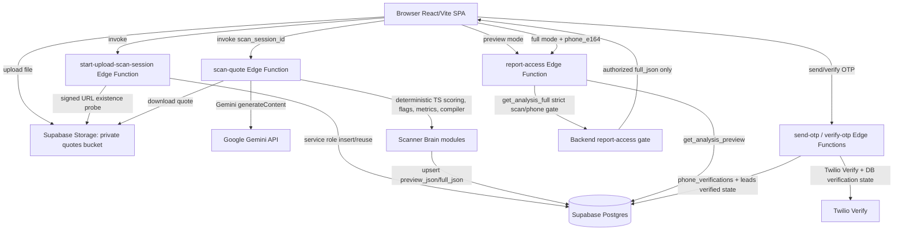

# WindowMan MVP

**Audit baseline:** `forensic_report_v2` at commit `3edfc6dd89fc1db3116f77277a82e8be4ed35bb7`  
**Repository:** `https://github.com/Mongoloyd/wm-mvp`  
**Audit date:** `2026-07-20`

WindowMan MVP is a consumer quote-intelligence platform that protects homeowners from overpaying on window replacement estimates. It is implemented as a React/Vite single-page application backed by Supabase Database, Storage, Auth, and Deno Edge Functions.

The core product flow captures quote-owner intake, uploads a quote file to a private Supabase Storage bucket, creates a scan session, runs a server-side quote scan, stores preview and full report payloads in `public.analyses`, renders a preview report, and unlocks the full report only after server-recorded SMS OTP verification.

The scanner sends uploaded quote content to Gemini for structured extraction, then computes scores, grades, hard caps, flags, derived financial metrics, preview JSON, and full report JSON in deterministic TypeScript code.

---

## Quick Navigation

| Section | Purpose |
|---|---|
| [Current Repository Reality](#current-repository-reality) | Pinned repo, branch, route, table, runtime, and package-manager facts |
| [Implemented Product Flow](#implemented-product-flow) | End-to-end quote upload, scan, preview, OTP, and full reveal sequence |
| [Architecture](#architecture) | System-level Mermaid diagram |
| [Core Stack](#core-stack) | Verified technology stack and runtime roles |
| [Repository Layout](#repository-layout) | Major source directories and responsibilities |
| [Routing](#routing) | Public, authenticated, redirect, dev, sandbox, and visual QA routes |
| [Canonical Data Flow](#canonical-data-flow) | Intake, upload, scan, extraction, scoring, persistence, preview, OTP, and full retrieval |
| [Report Access and Security Contract](#report-access-and-security-contract) | Verify-to-Reveal rules and backend authorization boundaries |
| [Supabase Architecture](#supabase-architecture) | Tables, RPCs, private storage buckets, and config mismatches |
| [Edge Function Inventory](#edge-function-inventory) | Edge Functions grouped by product area |
| [AI and Deterministic Analysis Boundary](#ai-and-deterministic-analysis-boundary) | Gemini extraction vs deterministic TypeScript scoring |
| [Tracking and External Integrations](#tracking-and-external-integrations) | Browser/server integrations and verified call paths |
| [Environment Configuration](#environment-configuration) | Browser-visible, server-only, and test/dev variables |
| [Local Development](#local-development) | Verified local setup constraints and startup commands |
| [Available Commands](#available-commands) | `package.json` command surface and prerequisites |
| [Testing](#testing) | Static test inventory, frameworks, and audit execution status |
| [Deployment and Runtime Boundaries](#deployment-and-runtime-boundaries) | SPA fallback, Deno runtime, service-role isolation, CI, and external dependencies |
| [Common Failure Modes](#common-failure-modes) | Known evidence-backed failure causes |
| [Commonly Misidentified Technologies](#commonly-misidentified-technologies) | Technologies and assumptions absent from this pinned tree |
| [Change-Safety Boundaries](#change-safety-boundaries) | High-blast-radius files and invariants |
| [Evidence and Audit Notes](#evidence-and-audit-notes) | Audit method, source paths, limitations, and material unknowns |
| [Operating Principles](#operating-principles) | Non-negotiable architecture and security rules |

---

## Current Repository Reality

| Item | Verified reality |
|---|---|
| Repository | `https://github.com/Mongoloyd/wm-mvp` |
| Audited branch | `forensic_report_v2` |
| Audited commit | `3edfc6dd89fc1db3116f77277a82e8be4ed35bb7` |
| Primary package manager | Mixed: `package-lock.json`, `bun.lock`, and `deno.lock` are present. `package.json` scripts are the canonical command surface; `predev`, `prebuild`, and `scanner:fixtures` require Bun commands. |
| Frontend dev URL | Vite config: `http://localhost:8080` via `server.host = "::"` and `server.port = 8080` |
| Playwright default URL | `http://localhost:5173` unless `PLAYWRIGHT_BASE_URL` or `BASE_URL` is set |
| Canonical report route | `/report/classic/:sessionId` |
| Compatibility redirects | `/report/:sessionId` redirects to `/report/classic/:sessionId`; several root dev aliases redirect to `/admin/*` only in `import.meta.env.DEV` |
| Primary report table | `public.analyses` |
| Legacy or compatibility report table | `public.quote_analyses` remains in migrations and is later RLS-hardened; no current full-report flow uses it as canonical storage |
| Dedicated reports table | Absent in migration table creation inventory |
| Report storage bucket | Supabase Storage bucket `quotes`, set `public = false` by migration |
| Frontend runtime | Browser React 18 + Vite + React Router |
| Edge Function runtime | Supabase Edge Functions on Deno, using `Deno.serve` and remote `esm.sh` imports |

---

## Implemented Product Flow

1. A browser user enters the React SPA through public routes such as `/`, `/quote-check`, `/window-prices`, `/window-price-audit`, `/truth-report`, `/ai-demo`, `/estimate`, `/diagnosis`, `/nextdoor`, `/windowman`, or static content routes.

2. The application initializes a persistent lead ID and captures URL attribution before React renders in `src/main.tsx`.

3. Quote upload UI in `src/components/UploadZone.tsx` validates file size and MIME type client-side, then uploads to Supabase Storage bucket `quotes`.

4. The browser invokes `start-upload-scan-session`, which verifies the private storage object exists, resolves or creates `leads`, `quote_files`, and `scan_sessions`, and returns `scan_session_id`, `quote_file_id`, and `lead_id`.

5. The browser invokes `scan-quote` with the returned IDs. The function uses service-role Supabase access, downloads the uploaded file from `quotes`, calls Gemini unless a dev fixture bypass is active, validates extracted JSON, applies a classification gate, computes deterministic grades and report payloads, upserts `analyses`, and updates `scan_sessions.status` to `preview_ready`.

6. `/report/classic/:sessionId` fetches a preview through the `report-access` Edge Function and renders a partial report.

7. The full report path uses `send-otp` and `verify-otp`. Verification creates/updates `phone_verifications`, binds the phone verification to the scan session, updates `leads.phone_verified`, `leads.phone_e164`, and `leads.phone_verified_at`, and returns server-canonical event IDs.

8. After OTP verification, the frontend calls `report-access` in full mode with `scan_session_id` and server-canonical `phone_e164`. `report-access` calls `get_analysis_full`; unauthorized access returns a locked sentinel rather than `full_json`.

9. Full report rendering occurs only after authorized full data is returned. Browser `localStorage` stores a 24-hour per-scan resume record, but the resume path still re-calls the backend full gate.

### Incomplete or Alternative Flows

| Flow | Status |
|---|---|
| `/vault`, `/vault/upload`, `/vault/reports/:reportId` | Absent in top-level router at this commit |
| `/signin`, `/signup`, `/verify`, `/demo` | Absent in top-level router at this commit |
| Contractor/partner portal | Partially implemented under `/partner/*`, with guarded portal, opportunities, revenue, and dossier routes |
| Admin back office | Implemented under `/admin/*`, frontend-gated by session except in Vite dev mode, with backend role checks in admin Edge Functions |
| Visual QA routes | `/visual/report-preview`, `/visual/pre-upload-intake`, and `/visual/intake-preview` are production-reachable unlisted QA/mock surfaces |
| Sandbox/dev routes | `/dev/report-preview`, `/devtesting`, `/sandbox/report-preview`, `/sandbox/intake`, `/dialer`, `/settings`, `/partners`, and root admin-tab aliases are gated by `import.meta.env.DEV` |

---

## Architecture



---

## Core Stack

| Area | Verified technology | Version source | Runtime role |
|---|---|---|---|
| Frontend framework | React, React DOM | `package.json` dependencies `react`, `react-dom` `^18.3.1` | Browser UI |
| Frontend build | Vite | `package.json` dependency `vite ^7.3.2`; `vite.config.ts` | Dev server and production build |
| Routing | `react-router-dom` | `package.json` dependency `^6.30.1`; `src/App.tsx` | SPA routing |
| Data fetching/state | TanStack Query, Zustand, React state | `package.json`; `src/App.tsx`; state modules | Browser state and cache |
| UI primitives | Radix UI, shadcn-style local components, Tailwind CSS, `lucide-react` | `package.json`, `tailwind.config.ts`, component imports | Browser UI |
| Supabase browser client | `@supabase/supabase-js` | `package.json` dependency `^2.99.2`; `src/integrations/supabase/client.ts` | Auth, Storage, Functions, direct RPCs |
| Edge Functions | Deno + Supabase JS | `deno.json`, function imports from `esm.sh/@supabase/supabase-js@2.49.x` | Server-side business logic |
| AI extraction | Google Gemini REST API | `scan-quote`, `compare-quotes`, `generate-negotiation-script`, `windowman-concierge` call `generativelanguage.googleapis.com` | Server-side extraction/generation |
| SMS OTP | Twilio Verify and optional Twilio Lookup | `send-otp`, `verify-otp`, `qualify-homepage-lead` | Server-side phone verification |
| Payments | Stripe | `deno.json`, `create-checkout-session`, `stripe-webhook`, `package.json` has no browser Stripe SDK | Server-side checkout/webhook |
| Email | Resend API | Edge Function environment lookups and call paths in follow-up/dispatch/email functions | Server-side email dispatch |
| E2E tests | Playwright | `package.json`, `playwright.config.ts` | Browser automation |
| Unit/component tests | Vitest + Testing Library + jsdom | `package.json`, `vitest.config.ts` | Frontend tests |
| Edge tests | Deno test files | `deno.json`, `supabase/functions/**/*.test.ts` | Edge/shared module tests |

---

## Repository Layout

| Path | Verified responsibility |
|---|---|
| `src/main.tsx` | Browser entrypoint; initializes lead ID and UTM capture, renders `App` |
| `src/App.tsx` | Top-level React Router declarations, providers, lazy-loaded route modules |
| `src/routes/` | Nested admin and partner routers; admin tab route helpers |
| `src/components/UploadZone.tsx` | Browser file validation, private storage upload, scan-session bootstrap, scan invocation |
| `src/hooks/useAnalysisData.ts` | Preview/full report fetch orchestration and browser resume logic |
| `src/hooks/usePhonePipeline.ts` | Browser OTP send/verify orchestration through service module |
| `src/services/reportService.ts` | Browser transport to `report-access`, `dev-report-unlock`, and `get_scan_status` |
| `src/services/phoneVerificationService.ts` | Browser transport to `send-otp` and `verify-otp` |
| `src/integrations/supabase/client.ts` | Browser Supabase client construction from `VITE_SUPABASE_*` variables |
| `supabase/functions/` | Deno Edge Functions and shared server modules |
| `supabase/functions/scan-quote/` | Scanner request validation, classification, deterministic scoring, flagging, report compilation |
| `supabase/functions/_shared/` | Shared Edge utilities for auth, metrics, tracking, CORS, OTP observability, CAPI routing |
| `supabase/migrations/` | Chronological Postgres, RLS, storage, RPC, and trigger migrations |
| `src/integrations/supabase/types.ts` | Generated Supabase TypeScript types; secondary schema evidence |
| `tests/` | Playwright specs and fixtures |
| `.github/workflows/` | CI guardrails for Deno functions and migration integrity |
| `public/_redirects` | SPA host fallback: `/* /index.html 200` |

---

## Routing

### Public Production Routes

| Route | Component/module | Classification |
|---|---|---|
| `/` | `src/pages/Index.tsx` | Public production |
| `/quote-check` | `PricingSearchLanding` | Public production |
| `/window-prices` | `WindowPricesLanding` | Public production |
| `/window-price-audit` | `WindowPriceAuditLanding` | Public production |
| `/truth-report` | `TruthReportLanding` | Public production |
| `/ai-demo` | `AiDemoLanding` | Public production |
| `/lp/:slug` | `LandingPage` | Public production |
| `/estimate` | `Estimate` | Public production |
| `/diagnosis` | `Diagnosis` | Public production |
| `/report/classic/:sessionId` | `ReportClassic` | Public route with backend-gated full payload |
| `/contractors3` | `Contractors3` | Public production |
| `/about` | `About` inside `PublicLayout` | Public production |
| `/contact` | `Contact` inside `PublicLayout` | Public production |
| `/faq` | `FAQ` inside `PublicLayout` | Public production |
| `/privacy` | `Privacy` inside `PublicLayout` | Public production |
| `/terms` | `Terms` inside `PublicLayout` | Public production |
| `/disclaimer` | `Disclaimer` inside `PublicLayout` | Public production |
| `/how-we-beat-window-quotes` | `HowWeBeatWindowQuotes` inside `PublicLayout` | Public production |
| `/contractors` | `Contractors` inside `PublicLayout` | Public production |
| `/contractors2` | `Contractors2` inside `PublicLayout` | Public production |
| `/partner/login` | `ContractorLogin` | Public partner auth route |
| `/partner/join` | `ContractorLogin initialView="register"` | Public partner registration route |
| `/partner/reset-password` | `PartnerResetPassword` | Public partner auth route |
| `/partner/accept-invite` | `AcceptInvite` | Public invite route |
| `/partner/onboarding` | `ContractorOnboarding` | Public route in router; page behavior may call backend |
| `/nextdoor` | `NextdoorHome` | Public production |
| `/windowman` | `WindowManLanding` | Public production |

### Authenticated Production Routes

| Route | Guard | Notes |
|---|---|---|
| `/admin/*` except auth/health routes | `AdminAuthGate` frontend session gate; backend admin functions use shared role validation | `AdminAuthGate` bypasses in `import.meta.env.DEV`; production redirects anonymous users to `/admin/login` |
| `/admin/leads` | `AdminAuthGate` | Admin lead inbox |
| `/admin/leads/:id` | `AdminAuthGate` | Admin lead dossier |
| `/admin/leads/:id/report` | `AdminAuthGate` | Admin lead report |
| `/admin/lead-evidence` | `AdminAuthGate` | Admin evidence route |
| `/admin/settings` | `AdminAuthGate` | Admin settings |
| `/admin/partners` | `AdminAuthGate` | Admin partners |
| `/admin/lab/report-preview` | `AdminAuthGate` | Admin-gated lab route |
| `/admin/lab/devtesting` | `AdminAuthGate` | Admin-gated lab route |
| `/admin/:tab` | `AdminAuthGate` plus `isAdminDashboardTab` | Dynamic admin dashboard tab route |
| `/partner/portal` | `PartnerGuard` | Requires Supabase session and active `contractor_profiles` row |
| `/partner/opportunities` | `PartnerGuard` | Partner opportunities |
| `/partner/revenue` | `PartnerGuard` | Partner revenue dashboard |
| `/partner/dossier/:id?` | `PartnerGuard` | Partner dossier |

### Redirect and Compatibility Routes

| Route | Behavior |
|---|---|
| `/report/:sessionId` | Redirects to `/report/classic/:sessionId` |
| `/admin` | Redirects to `/admin/leads` after `AdminAuthGate` |
| `/dialer` | In dev mode only, redirects to `/admin/dialer` |
| `/settings` | In dev mode only, redirects to `/admin/settings` |
| `/partners` | In dev mode only, redirects to `/admin/partners` |
| `/:devAdminAlias` | In dev mode only, redirects to `/admin/:devAdminAlias` when alias is a valid admin tab and not denylisted |

### Development, Sandbox, and Visual QA Routes

| Route | Gate | Classification |
|---|---|---|
| `/visual/report-preview` | None in router | Visual QA/mock route, production-reachable |
| `/visual/pre-upload-intake` | None in router | Visual QA/mock route, production-reachable |
| `/visual/intake-preview` | None in router | Visual QA/mock route, production-reachable |
| `/dev/report-preview` | `import.meta.env.DEV` | Development-only |
| `/devtesting` | `import.meta.env.DEV` | Development-only |
| `/sandbox/report-preview` | `import.meta.env.DEV` | Sandbox visual QA |
| `/sandbox/intake` | `import.meta.env.DEV` | Sandbox visual QA |
| `*` | `NotFound` | Fallback |

---

## Canonical Data Flow

### Intake and Lead Capture

Implemented through several public services and functions, including `capture-truth-gate-lead`, `capture-power-tool-demo-lead`, `capture-arbitrage-lead`, `qualify-homepage-lead`, `submit-diagnosis-intake`, and attribution utilities.

`src/main.tsx` initializes `getLeadId()` and `captureUtmFromUrl()` before rendering.

### Upload and Storage

`src/components/UploadZone.tsx` accepts PDF/images up to 10 MB, writes to Supabase Storage bucket `quotes`, and uses deterministic storage paths from `src/components/uploadZone/storagePath.ts`.

### Scan-Session Creation

`UploadZone` invokes `start-upload-scan-session`.

The function validates a zod request contract, probes the private storage object through a signed URL, resolves or creates `leads`, `quote_files`, and `scan_sessions`, emits operational audit events to `event_logs`, and returns IDs.

### Document Processing

`UploadZone` invokes `scan-quote`.

The function validates the request via `scan-quote/requestSchema.ts`, handles stale session recovery via `sessionRecovery.ts`, sets `scan_sessions.status`, retrieves `quote_files.storage_path`, downloads from Storage bucket `quotes`, and enforces size/runtime limits from `_shared/scannerConfig.ts`.

### AI Extraction

`scan-quote` builds a Gemini `generateContent` URL through `_shared/scannerConfig.ts`, uses `GEMINI_API_KEY`, posts the uploaded file content to Gemini, normalizes returned text through `_shared/geminiJson.ts`, parses JSON, and validates the extraction shape before scoring.

### Deterministic Scoring

`scan-quote/scoring.ts` computes five pillar scores, weighted averages, letter grades, and hard caps.

`scan-quote/flagging.ts` computes flags.

`_shared/metrics.ts` computes deterministic derived financial metrics.

`scan-quote/reportCompiler.ts` compiles warnings, missing items, summaries, payment-risk, scope-gap, and price-per-opening fields.

### Persistence

`scan-quote` upserts `public.analyses` on `scan_session_id`, storing:

- `proof_of_read`
- `preview_json`
- `full_json`
- `grade`
- `flags`
- `confidence_score`
- `document_type`
- `rubric_version`
- derived scalar columns

It updates `leads` snapshot fields and appends `lead_events`.

### Preview Retrieval

`src/hooks/useAnalysisData.ts` calls `fetchAnalysisPreview`, which invokes `report-access` with:

```ts
{ mode: "preview", scan_session_id }
```

`report-access` calls `get_analysis_preview` and strips `full_json` defensively before returning data.

### OTP Verification

`src/hooks/usePhonePipeline.ts` calls `sendOtp()` and `verifyOtp()` from `src/services/phoneVerificationService.ts`.

`send-otp` validates US E.164 phone numbers, applies cooldown/window rate limits using `phone_verifications`, optionally calls Twilio Lookup, calls Twilio Verify, expires older pending rows, and inserts a pending row bound to `scan_session_id`.

`verify-otp` looks up a pending row bound to the requested scan session, calls Twilio `VerificationCheck` unless QA bypass is approved, updates `phone_verifications`, updates `leads`, and persists canonical events.

### Full Report Retrieval

`fetchAnalysisFull` invokes `report-access` with:

```ts
{ mode: "full", scan_session_id, phone_e164 }
```

`report-access` validates UUID and E.164 inputs and calls `get_analysis_full`.

The latest migration defines `get_analysis_full` to require a verified `phone_verifications` row whose `scan_session_id`, `lead_id`, and phone match the requested scan and lead, and requires `leads.phone_verified = true`.

---

## Report Access and Security Contract

| Boundary | Verified backend behavior |
|---|---|
| Preview payload | `report-access` preview mode calls `get_analysis_preview`; response includes grade, flag counts, proof of read, preview JSON, confidence, document type, rubric version, and analysis ID. `full_json` is stripped before response. |
| Full payload | `report-access` full mode calls `get_analysis_full`; authorized rows include flags, `full_json`, proof_of_read, `preview_json`, confidence, document type, rubric version, and a curated `v2_source` projection when useful. |
| Unauthorized full request | `get_analysis_full` returns sentinel grade `__UNAUTHORIZED__`; `report-access` converts this to `{ authorized: false, locked: true, reason: "unauthorized" }`. |
| OTP binding | `send-otp` inserts `phone_verifications.scan_session_id`; `verify-otp` prefers scan-bound pending rows and updates the verified row with `lead_id` and `scan_session_id`; `get_analysis_full` enforces exact scan-session binding. |
| Browser resume | `src/lib/verifiedAccess.ts` stores one `localStorage` record with `scan_session_id`, `phone_e164`, `verified_at`, and `expires_at`. This is only a UX resume input; full data still comes from `report-access` and `get_analysis_full`. |
| Service-role boundary | Browser code uses `VITE_SUPABASE_URL` plus publishable/anon key. Service-role keys are read only in Edge Functions and scripts through `Deno.env.get` or `process.env`. |
| Dev full-report bypass | Browser bypass is possible only when `import.meta.env.DEV` and a local `wm_dev_secret` exists. Server bypass through `dev-report-unlock` requires `DEV_BYPASS_ENABLED === "true"` and a matching `DEV_BYPASS_SECRET`; otherwise it returns `404` or `403`. |
| Admin bypass | Shared `adminAuth.ts` accepts `x-dev-secret` only when `DEV_BYPASS_ENABLED === "true"` and `DEV_BYPASS_SECRET` matches; otherwise it validates a Bearer JWT and reads `user_roles`. |
| RLS and grants | Migrations enable RLS for sensitive tables including `analyses`, `phone_verifications`, `quote_analyses`, partner/dispatch tables, and tracking tables. Later migrations revoke destructive privileges from `anon` and `authenticated`. |
| Storage privacy | `quotes` bucket is updated to `public = false`; anonymous SELECT policy is dropped. Anonymous/authenticated INSERT and UPDATE policies exist for upload/upsert; table-level storage grants are restored so RLS can evaluate those writes. |

---

## Supabase Architecture

### Important Current Tables

| Table | Role in implemented system | Runtime referenced |
|---|---|---|
| `leads` | Lead/contact/session identity, phone verification snapshot, attribution, latest scan/analysis snapshot | Yes |
| `quote_files` | Maps uploaded private storage path to a lead | Yes |
| `scan_sessions` | Scan lifecycle and report route key | Yes |
| `analyses` | Canonical report storage: proof, preview, full JSON, grade, flags, status | Yes |
| `phone_verifications` | OTP lifecycle and scan-bound full-report authorization | Yes |
| `event_logs` | Operational event telemetry | Yes |
| `lead_events` | Operational lead timeline | Yes |
| `contractor_opportunities` | Contractor intro/match request state hydrated by report page and Edge Functions | Yes |
| `voice_followups` | Callback/follow-up queue from report CTA paths | Yes |
| `contractor_profiles` | Partner route guard checks active partner state | Yes |
| `contractor_accounts`, `lead_assignments`, `lead_contact_releases`, `lead_contact_release_events` | Partner/syndicate lead routing and contact release surfaces | Yes |
| `wm_event_log` | Canonical server-side event persistence | Yes, through tracking shared modules |
| `platform_dispatch_outbox`, `platform_dispatch_attempts`, `client_platform_configs` | Conversion/platform dispatch control plane | Yes |
| `quote_analyses` | Legacy table from initial schema | Current but not canonical; later RLS-hardened |

### Important RPCs

| RPC | Role |
|---|---|
| `get_scan_status(uuid)` | Browser polling of scan session state |
| `get_analysis_preview(uuid)` | Preview report retrieval through `report-access` |
| `get_analysis_full(uuid, text)` | Full report retrieval with strict scan/phone verification binding |
| `get_lead_by_session(text)` | Lead resolution during upload bootstrap |
| `get_upload_retry_context(...)` | Upload retry rebind path from `UploadZone` |
| `get_rubric_stats(...)` | Rubric/admin stats hook |
| `get_county_by_scan_session(...)` | Report county display lookup; called through an untyped RPC in `ReportClassic` |
| `admin_*` RPCs | Admin dashboards, revenue dispatch, outcome integrity, dispatch outbox |
| `wm_claim_dispatch_rows`, `wm_claim_dispatch_rows_scoped` | Dispatch worker row claiming |
| `upsert_native_lead_with_attribution` | Native lead ingestion atomic RPC |
| `get_contractor_released_contact` | Partner contact release retrieval |

### Private Storage Buckets

| Bucket | Evidence |
|---|---|
| `quotes` | Created by initial migration; updated to `public = false`; used by `UploadZone`, `start-upload-scan-session`, and `scan-quote` |

### Function and Config Mismatches

| Mismatch | Evidence |
|---|---|
| `nextdoor-capi-event` | Has `supabase/functions/nextdoor-capi-event/index.ts` and call sites, but no `[functions.nextdoor-capi-event]` block in `supabase/config.toml` |
| Config blocks without entrypoint | Absent in the pinned comparison |

All functions listed in `supabase/config.toml` have `verify_jwt = false`.

This does not by itself prove they are unrestricted. Authorization is implemented inside individual function bodies where present, including admin JWT/role validation, dispatch secrets, native-lead secrets, import secrets, OTP state checks, and report RPC gates.

---

## Edge Function Inventory

### Scan and Report

| Function | Responsibility | Authorization notes |
|---|---|---|
| `start-upload-scan-session` | Service-role bootstrap for `leads`, `quote_files`, `scan_sessions`; private storage object probe | `verify_jwt = false`; validates request; optional `ENFORCE_CONTACT_OWNED_UPLOAD`; service-role transport bypass only with exact service-role bearer |
| `scan-quote` | Private file download, Gemini extraction, classification, deterministic scoring, persistence | `verify_jwt = false`; validates scan/session IDs and service-role DB state |
| `report-access` | Preview/full report proxy over service-role-only RPCs | `verify_jwt = false`; preview is public by scan UUID; full requires `get_analysis_full` authorization |
| `dev-report-unlock` | Dev/design full-report bypass | Disabled unless `DEV_BYPASS_ENABLED === "true"` and secret matches |
| `dev-create-quote-scenario` | Dev scenario generation | Uses `DEV_BYPASS_SECRET` |
| `compare-quotes` | Gemini-assisted comparison path | Calls Gemini and Supabase service role |
| `generate-negotiation-script` | Gemini-assisted script generation | Calls Gemini and Supabase service role |
| `calculate-estimate-metrics` | Estimate metric calculation | Registered with `verify_jwt = false` |

### OTP and Access

| Function | Responsibility |
|---|---|
| `send-otp` | Normalize/validate phone, optional Twilio Lookup, rate limit, Twilio Verify send, insert pending verification |
| `verify-otp` | Twilio `VerificationCheck` or QA bypass, scan-bound pending row lookup, persist verified state, update lead |
| `unlock-lead` | Contractor credit/lead unlock path |
| `accept-invite` | Partner invitation acceptance |

### Lead Intake and Public Funnel

| Function | Responsibility |
|---|---|
| `capture-truth-gate-lead` | Public lead capture |
| `capture-power-tool-demo-lead` | Public demo lead capture |
| `capture-arbitrage-lead` | Public arbitrage lead capture with optional progressive capture |
| `qualify-homepage-lead` | Homepage lead qualification and optional Twilio Lookup |
| `submit-diagnosis-intake` | Diagnosis intake persistence |
| `persist-diagnosis-start` | Diagnosis-start persistence |
| `update-homeowner-context` | Homeowner context updates |
| `request-callback` | Report/estimate callback request, writes follow-up/opportunity state |
| `request-partner-access` | Partner access request and email dispatch |

### Admin

| Function | Responsibility |
|---|---|
| `admin-data` | Large admin data API surface; imports shared admin auth |
| `admin-client-platform-config` | Client platform configuration |
| `admin-contractor-performance` | Contractor performance reporting |
| `admin-materialize-dispatch-outbox` | Dispatch outbox materialization |
| `admin-route-lead` | Lead routing |
| `admin-simulate-dispatch-attempt` | Dispatch simulation |
| `admin-sync-revenue-signals` | Revenue signal sync |

### Partner and Contractor

| Function | Responsibility |
|---|---|
| `generate-contractor-brief` | Requires report authorization through `get_analysis_full`, then builds opportunity/brief state |
| `contractor-actions` | Contractor action API |
| `contractor-submit-outcome` | Contractor outcome submission |
| `contractor-booking-confirmed` | Cron/secret-gated contractor booking update |
| `contractor-mark-no-show` | Cron/secret-gated no-show update |
| `contractor-send-followups` | Contractor follow-up sending with Resend |
| `contractor-performance-summary` | Contractor performance summary |
| `get-contractor-document-url` | Signed document access for contractor path |
| `get-contractor-dossier` | Contractor dossier retrieval |
| `list-contractor-opportunities` | Partner opportunity listing |
| `partner-update-disposition` | Partner disposition update |
| `save-routing-preferences` | Partner onboarding routing preferences |

### Tracking, Attribution, and Conversion

| Function | Responsibility |
|---|---|
| `capi-event` | Meta CAPI event endpoint |
| `tiktok-capi-event` | TikTok Events API endpoint |
| `google-ads-conversion-event` | Google Ads conversion dispatch endpoint |
| `dispatch-platform-events` | Dispatches platform events to Meta, Nextdoor, TikTok, and Google paths |
| `import-facebook-lead-ad` | Secret-gated Facebook lead ad import |
| `ingest-native-lead` | Secret-gated native lead ingestion |
| `dispatch-lead` | Lead dispatch and email/webhook behavior |
| `process-webhook` | Secret-gated webhook processing |
| `lead-reactivation` | Secret-gated reactivation email path |
| `refresh-benchmarks` | Secret-gated benchmark refresh |
| `qa-google-attribution-event` | QA helper for Google attribution |
| `windowman-concierge` | Gemini-backed concierge function |
| `voice-followup` | Voice follow-up webhook path |
| `dial-lead` | Phone-call bot webhook path |
| `enrich-lead` | Lead enrichment |

---

## AI and Deterministic Analysis Boundary

| Boundary | Verified implementation |
|---|---|
| Model input | `scan-quote` downloads the uploaded quote file from private Storage, converts it to a Gemini request part, and posts it to `https://generativelanguage.googleapis.com/v1beta/models/{model}:generateContent` with `GEMINI_API_KEY` |
| Model selection | `GEMINI_SCAN_MODEL` can override default scanner model in `_shared/scannerConfig.ts`; otherwise the configured default string is used |
| Model output | Gemini is expected to return JSON matching the extraction schema embedded in the prompt; `scan-quote` normalizes and parses returned text |
| Extraction validation | `validateExtraction` requires object shape, document type, boolean window/door relation, confidence `0..1`, and `line_items` with string descriptions |
| Classification | `classificationGate.ts` normalizes classification and can terminate scans as `invalid_document` or `needs_better_upload` |
| Grade assignment | `scan-quote/scoring.ts` computes pillar scores, weighted average, letter grade, and hard caps |
| Financial metrics | `_shared/metrics.ts` computes bucket totals, per-opening values, coverage, benchmarks, and diagnostics |
| Flags | `scan-quote/flagging.ts` computes red/amber/green-equivalent issue flags with severity strings |
| Preview payload | Built in `scan-quote/index.ts` from deterministic grade result, flags, compiled report, and proof-of-read |
| Full payload | Built in `scan-quote/index.ts` and includes grade, weighted average, hard cap, pillar scores, flags, raw extraction, derived metrics, warnings, missing items, summary, and risk booleans |
| Persistence | `scan-quote` upserts `public.analyses` with both `preview_json` and `full_json` |
| Provider behavior | Gemini model internals and extraction accuracy are unknown; only request/response handling and downstream deterministic processing are verified |

---

## Tracking and External Integrations

| Integration | Verified call path | Browser/server |
|---|---|---|
| Supabase Auth | Browser client persists sessions; admin/partner gates call `supabase.auth`; Edge admin auth validates bearer tokens | Browser and server |
| Supabase Database | Browser direct queries for allowed state; Edge Functions use service-role for privileged paths | Browser and server |
| Supabase Storage | Browser uploads to `quotes`; Edge Functions create signed URLs and download private files | Browser and server |
| Gemini | `scan-quote`, `compare-quotes`, `generate-negotiation-script`, `windowman-concierge` | Server |
| Twilio Verify | `send-otp`, `verify-otp` | Server |
| Twilio Lookup | `send-otp` and `qualify-homepage-lead` when `TWILIO_LOOKUP_ENABLED === "true"` | Server |
| Meta Pixel | `src/lib/metaBrowserPixel.ts` injects `connect.facebook.net/en_US/fbevents.js` and calls `fbq("init")` / `fbq("track", "PageView")` when `VITE_META_PIXEL_ID` is configured and not placeholder | Browser |
| GTM/dataLayer | `src/lib/trackConversion.ts` pushes events to `window.dataLayer` | Browser |
| Meta CAPI | `capi-event`, `_shared/capiRouting.ts`, `dispatch-platform-events` | Server |
| TikTok Events API | `tiktok-capi-event`, `_shared/tiktokCapiRouting.ts`, `dispatch-platform-events` | Server |
| Nextdoor CAPI | `_shared/nextdoorCapiRouting.ts`, `dispatch-platform-events`, `nextdoor-capi-event` entrypoint | Server; config mismatch noted |
| Google Ads conversion | `google-ads-conversion-event`, `dispatch-platform-events` | Server |
| Stripe | `create-checkout-session`, `stripe-webhook` | Server |
| Resend | Contractor follow-up, dispatch, reactivation, partner access, handoff, report email functions | Server |
| Phone-call bot webhook | `dial-lead`, `request-callback`, `voice-followup` | Server |
| CRM webhook | `process-webhook` | Server |
| Lovable API | `dispatch-lead` | Server |

---

## Environment Configuration

### Browser-Visible Configuration

Variables with `VITE_` are browser-exposed by Vite.

| Variable | Consuming modules | Purpose | Required status |
|---|---|---|---|
| `VITE_SUPABASE_URL` | `src/integrations/supabase/client.ts`, admin services, session service | Supabase project URL for browser client and function URLs | Required for browser app startup; missing value throws |
| `VITE_SUPABASE_PUBLISHABLE_KEY` | `src/integrations/supabase/client.ts` | Preferred browser Supabase key | Required unless `VITE_SUPABASE_ANON_KEY` is present |
| `VITE_SUPABASE_ANON_KEY` | `src/integrations/supabase/client.ts`, session service | Fallback browser Supabase key | Required unless publishable key is present |
| `VITE_META_PIXEL_ID` | `src/lib/metaBrowserPixel.ts` | Browser Meta Pixel initialization | Optional; no-op when absent or placeholder |
| `VITE_AUTH_GUARD_DEV_BYPASS` | `src/components/auth/AuthGuard.tsx` | Dev-only auth guard bypass | Optional; only active with `import.meta.env.DEV` |
| `VITE_ENABLE_DARK_V2_HOMEPAGE` | `src/pages/Index.tsx` | Homepage report variant flag | Optional |
| `VITE_ARBITRAGE_PROGRESSIVE_CAPTURE` | `src/pages/About.tsx` | About-page capture behavior flag | Optional |
| `VITE_INTAKE_ROUTER_ENABLED` | `src/pages/About.tsx` | Intake routing feature flag | Optional |
| `VITE_NEXTDOOR_CAPI_ENABLED` | Browser tracking eligibility modules | Browser-side eligibility flag | Optional |
| `VITE_TIKTOK_CAPI_ENABLED` | Browser tracking eligibility modules | Browser-side eligibility flag | Optional |

### Server-Only Variables and Secrets

| Variable | Consuming subsystem | Purpose | Required status |
|---|---|---|---|
| `SUPABASE_URL` | Most Edge Functions | Supabase project URL | Required for service-role functions that construct clients |
| `SUPABASE_SERVICE_ROLE_KEY` | Most privileged Edge Functions | Service-role DB/Storage access | Required for privileged Edge Function workflows |
| `SUPABASE_ANON_KEY` / `SUPABASE_PUBLISHABLE_KEY` | Admin/partner auth functions | User JWT validation client | Required for functions that validate user sessions |
| `GEMINI_API_KEY` | `scan-quote`, comparison/script/concierge functions | Gemini API access | Required for non-bypass AI workflows |
| `GEMINI_SCAN_MODEL` | `_shared/scannerConfig.ts` | Scanner model override | Optional |
| `GEMINI_SCAN_TIMEOUT_MS` | `_shared/scannerConfig.ts` | Scanner Gemini timeout override | Optional |
| `GEMINI_SCAN_MAX_OUTPUT_TOKENS` | `_shared/scannerConfig.ts` | Scanner output token budget override | Optional |
| `SCAN_STALE_PROCESSING_MINUTES` | `_shared/scannerConfig.ts` | Stale processing takeover threshold | Optional |
| `SCAN_MAX_FILE_BYTES` | `_shared/scannerConfig.ts` | Server-side max file bytes sent to scanner | Optional |
| `TWILIO_ACCOUNT_SID` | OTP and phone qualification | Twilio authentication | Required when Twilio send/verify/lookup paths run |
| `TWILIO_AUTH_TOKEN` | OTP and phone qualification | Twilio authentication | Required when Twilio send/verify/lookup paths run |
| `TWILIO_VERIFY_SERVICE_SID` | `send-otp`, `verify-otp` | Twilio Verify service | Required for real OTP |
| `TWILIO_LOOKUP_ENABLED` | `send-otp`, `qualify-homepage-lead` | Enables Twilio Lookup screening | Optional |
| `OTP_QA_BYPASS_ENABLED`, `OTP_QA_PHONE_E164`, `OTP_QA_CODE`, `OTP_QA_PROJECT_REF`, `WM_SUPABASE_PROJECT_REF` | OTP QA bypass helpers | Controlled OTP bypass | Conditional; only for QA bypass |
| `DEV_BYPASS_ENABLED`, `DEV_BYPASS_SECRET` | Admin auth, dev report unlock, dev quote scenario, scan dev bypass | Dev/staging bypass gate | Conditional |
| `ENFORCE_CONTACT_OWNED_UPLOAD` | `start-upload-scan-session` | Enforces contact-owned upload validation | Optional feature flag |
| `META_PIXEL_ID`, `META_CAPI_TOKEN`, `META_TEST_EVENT_CODE` | Meta CAPI routing/admin health | Meta server-side conversion dispatch | Conditional |
| `CAPI_DISPATCH_SECRET` | CAPI/Google dispatch | Dispatch secret | Conditional |
| `TIKTOK_ACCESS_TOKEN`, `TIKTOK_PIXEL_ID`, `TIKTOK_EVENT_SOURCE_ID`, `TIKTOK_TEST_EVENT_CODE`, `TIKTOK_EVENTS_API_ENDPOINT_URL`, `TIKTOK_CAPI_ENABLED` | TikTok dispatch | TikTok Events API | Conditional |
| `NEXTDOOR_CAPI_TOKEN`, `NEXTDOOR_DATA_SOURCE_ID`, `NEXTDOOR_CAPI_ENDPOINT_URL`, `NEXTDOOR_CAPI_ENABLED`, `NEXTDOOR_EVENT_SOURCE_URL` | Nextdoor dispatch | Nextdoor CAPI | Conditional |
| `GOOGLE_ADS_DISPATCH_AUTH_TOKEN`, `GOOGLE_ADS_DISPATCH_URL` | Google Ads dispatch | Google conversion dispatch | Conditional |
| `STRIPE_SECRET_KEY`, `STRIPE_WEBHOOK_SECRET` | Checkout and Stripe webhook | Stripe payments | Conditional |
| `RESEND_API_KEY`, `RESEND_FROM_EMAIL`, `REPORT_FROM_EMAIL` | Email dispatch functions | Resend email sending | Conditional |
| `REPORT_BASE_URL` | Email/checkout/reactivation links | Report URL construction | Optional/conditional |
| `CONTRACTOR_CRON_SECRET`, `REACTIVATION_CRON_SECRET`, `BENCHMARK_CRON_SECRET`, `PROCESS_WEBHOOK_SECRET`, `DISPATCH_LEAD_SECRET` | Cron/webhook/dispatch functions | Shared-secret protection | Conditional |
| `FACEBOOK_LEAD_AD_IMPORT_SECRET` | `import-facebook-lead-ad` | Import endpoint secret | Required for import endpoint use |
| `NATIVE_LEAD_INGEST_SECRET` | `ingest-native-lead` | Native lead ingestion secret | Required for native lead endpoint use |
| `CRM_WEBHOOK_URL`, `CRM_WEBHOOK_SECRET` | `process-webhook` | CRM webhook dispatch | Conditional |
| `PHONECALL_BOT_WEBHOOK_URL` | Dial/callback/voice functions | Phone-call bot integration | Conditional |
| `CONTRACTOR_EMAIL`, `CONTRACTOR_NAME` | Partner request/handoff functions | Contractor notification target/name | Conditional |
| `LOVABLE_API_KEY` | `dispatch-lead` | Lovable integration | Conditional |
| `QA_HELPER_ENABLED`, `QA_HELPER_SECRET`, `QA_HELPER_PROJECT_REF` | QA helper guard | QA helper access | Conditional |
| `WM_EDGE_DIAGNOSTICS`, `EDGE_DIAGNOSTICS` | Contractor dossier function | Edge diagnostics toggle | Optional |
| `WM_EVENT_SOURCE_URL` | Dispatch platform events | Event source URL | Optional |

### Development or Test-Only Configuration

| Variable | Consuming module | Purpose |
|---|---|---|
| `PLAYWRIGHT_BASE_URL`, `BASE_URL` | `playwright.config.ts`, E2E specs | Playwright target URL |
| `SITE_URL` | `scripts/generate-sitemap.ts` | Sitemap base URL; defaults to `https://windowman.app` |
| `CAPI_SMOKE_BASE_URL`, `CAPI_SMOKE_AUTH_TOKEN`, `CAPI_SMOKE_DISPATCH_SECRET` | `supabase/functions/capi-event/smoke_test.ts` | CAPI smoke test configuration |
| `SUPABASE_SERVICE_ROLE_KEY`, `SUPABASE_URL`, `VITE_SUPABASE_URL`, `VITE_SUPABASE_PUBLISHABLE_KEY` | Tests and verification scripts | Test/admin helper configuration |

---

## Local Development

Prerequisites verified from manifests and scripts:

- Node/npm are supported by `package-lock.json` and `package.json` scripts.
- Bun is required by lifecycle scripts: `predev`, `prebuild`, and `scanner:fixtures`.
- Deno is required for Supabase Edge Function development/tests.
- Supabase CLI is present as a dev dependency named `supabase`.
- Playwright is present as a dev dependency.
- The repository does not define package scripts for database reset, migration apply, or Supabase local start.
- Do not assume `db:*` scripts exist.

```bash
git clone https://github.com/Mongoloyd/wm-mvp.git
cd wm-mvp
git checkout forensic_report_v2
git rev-parse HEAD
npm ci
npm run dev
```

Open:

```bash
http://localhost:8080
```

Optional local Supabase operations must use the installed Supabase CLI directly; no repository `package.json` script wraps them at this commit.

---

## Available Commands

| Command | Behavior | Prerequisites | Lifecycle side effects |
|---|---|---|---|
| `npm run dev` | Starts Vite dev server | npm deps plus Bun for `bunx` | Runs `predev`: `bunx tsx scripts/generate-sitemap.ts` |
| `npm run build` | Production Vite build | npm deps plus Bun for `bunx` | Runs `prebuild`: `bunx tsx scripts/generate-sitemap.ts` |
| `npm run build:dev` | Vite build with `--mode development` | npm deps | No explicit pre hook |
| `npm run lint` | `eslint .` | npm deps | None |
| `npm run preview` | `vite preview` | Built app and npm deps | None |
| `npm test` | `vitest run` | npm deps | None |
| `npm run test:watch` | Vitest watch mode | npm deps | None |
| `npm run test:critical` | Runs selected critical Vitest files | npm deps | None |
| `npm run test:all` | Runs `vitest run && npx supabase functions test` | npm deps, Supabase CLI, Deno/function test prerequisites | None |
| `npm run test:e2e:legacy-golden-thread` | Playwright test for `tests/golden-thread.spec.ts` | npm deps, browser install, dev server | Playwright config starts `npm run dev` |
| `npm run test:e2e:scanner-smoke` | Placeholder command that only echoes a scanner-smoke TODO string | Shell only | No implemented test |
| `npm run typecheck` | `tsc --noEmit` | npm deps | None |
| `npm run proof:pageview` | `vitest run --config vitest.proof.config.ts` | npm deps | None |
| `npm run typegen` | Generates Supabase TypeScript types into `src/integrations/supabase/types.ts` | Supabase CLI, network/project access | Writes generated types file |
| `npm run typegen:check` | Compares generated Supabase types to committed file | Supabase CLI, `diff`, network/project access | No intended write |
| `npm run scanner:fixtures` | Runs `bun run scripts/scanner-fixture-report.ts` | Bun | None |

---

## Testing

### Static Test Inventory

| Test surface | Inventory at pinned commit |
|---|---|
| Frontend Vitest files under `src/` | 84 `*.test.ts` / `*.test.tsx` files |
| Supabase Edge/shared Deno test files | 40 `*.test.ts` / `_test.ts` files |
| SQL smoke/test files | 9 `.sql` files under `supabase/tests` and `scripts/validation` |
| Playwright specs | 7 specs under `tests/` |
| Placeholder scripts | `test:e2e:scanner-smoke` only echoes a TODO string and is not an implemented test |

### Test Frameworks

| Framework | Config |
|---|---|
| Vitest | `vitest.config.ts`, jsdom, globals, setup file `src/test/setup.ts`, includes `src/**/*.{test,spec}.{ts,tsx}` |
| Playwright | `playwright.config.ts`, Chromium project, web server command `npm run dev`, default base URL `http://localhost:5173` |
| Deno | `deno.json`, `deno.lock`, CI workflows run `deno lint`, `deno fmt --check`, and `deno check` |
| Supabase SQL tests | `.sql` files exist; no package script directly runs those SQL files |

### Executed Results During This Audit

Not executed during this audit.

Reason: the user required no repository modification and all implementation inspection was pinned to Git object `3edfc6dd89fc1db3116f77277a82e8be4ed35bb7`. Installing dependencies or running package tests would use and potentially mutate the working tree rather than a separate pinned checkout.

---

## Deployment and Runtime Boundaries

| Boundary | Verified evidence |
|---|---|
| SPA fallback | `public/_redirects` contains `/* /index.html 200` |
| Browser runtime | Vite browser bundle; `import.meta.env.VITE_*` variables are browser-visible |
| Server runtime | Supabase Edge Functions use Deno APIs including `Deno.serve`, `Deno.env.get`, and Web Fetch |
| Supabase function JWT behavior | Every function block in `supabase/config.toml` has `verify_jwt = false`; in-function authorization must be reviewed per endpoint |
| Service-role isolation | Service-role key is read in Edge Functions and scripts, not in browser client code |
| Storage privacy | `quotes` bucket is private; browser uploads are allowed by Storage RLS policies; public reads are not provided by the final bucket policy state inspected |
| Build lifecycle | `dev` and `build` run sitemap generation first through Bun |
| CI | Workflows include Deno lint/format, Deno typecheck, CAPI/pageview/estimate guardrails, and manual migration integrity |
| External network dependencies | Gemini, Twilio, Meta, TikTok, Nextdoor, Google Ads, Stripe, Resend, CRM webhook, phone-call bot, Lovable, Supabase |

---

## Common Failure Modes

| Failure | Evidence-backed cause |
|---|---|
| Browser app fails at startup | Missing `VITE_SUPABASE_URL` or missing both `VITE_SUPABASE_PUBLISHABLE_KEY` and `VITE_SUPABASE_ANON_KEY` throws in `src/integrations/supabase/client.ts` |
| `npm run dev` fails before Vite | `predev` runs `bunx tsx scripts/generate-sitemap.ts`; Bun must be installed |
| `npm run build` fails before Vite build | `prebuild` runs the same Bun sitemap script |
| Playwright targets wrong port | Playwright default base URL is `http://localhost:5173`, while Vite dev config uses port `8080`; set `PLAYWRIGHT_BASE_URL=http://localhost:8080` or `BASE_URL` when needed |
| Full report remains locked after OTP | `get_analysis_full` requires matching `phone_verifications.phone_e164`, `phone_verifications.status = 'verified'`, exact `scan_session_id`, matching `lead_id`, and `leads.phone_verified = true` |
| Preview available but full unavailable | Preview mode does not require phone verification; full mode does |
| Private quote upload retry fails | Storage RLS requires correct INSERT/UPDATE policy path and deterministic retry context; `UploadZone` has explicit orphan/conflict handling |
| Edge Function appears deployed locally but missing config | `nextdoor-capi-event` has an entrypoint and call sites but no config block in `supabase/config.toml` |
| Generated DB types drift | `typegen:check` compares remote generated types to `src/integrations/supabase/types.ts`; it requires Supabase CLI and project access |
| Admin page renders in dev without session | `AdminAuthGate` returns children immediately when `import.meta.env.DEV` is true; backend admin functions still perform their own checks unless dev secret bypass is used |
| Local migration command uncertainty | No package script exists for DB reset/apply; use Supabase CLI directly and verify command syntax from the installed CLI |
| Browser/server API confusion | Browser code uses `import.meta.env` and Supabase publishable/anon keys; Edge Functions use `Deno.env.get` and service-role keys |

---

## Commonly Misidentified Technologies

| Technology or assumption | Status | Basis |
|---|---|---|
| Next.js | Absent | No `next` dependency, no `next.config.*`, no Next `app`/`pages` routing in pinned tree |
| pnpm | Absent | No `pnpm-lock.yaml` in pinned tree |
| Yarn | Absent | No `yarn.lock` in pinned tree |
| Docker application runtime | Absent | No `Dockerfile` or `docker-compose.yml` in pinned tree |
| Vercel config | Absent | No `vercel.json` in pinned tree |
| Netlify config file | Absent | No `netlify.toml`; only `public/_redirects` SPA fallback exists |
| A canonical `reports` table | Absent | Migration table creation inventory shows `analyses` and legacy `quote_analyses`, not `reports` |
| Frontend direct Gemini calls | Absent for scanner path | Gemini API calls are in Edge Functions/scripts, not browser scanner code |
| Browser service-role key | Absent | Browser Supabase client reads only `VITE_SUPABASE_URL`, `VITE_SUPABASE_PUBLISHABLE_KEY`, and `VITE_SUPABASE_ANON_KEY` |
| Package scripts for DB migration/reset | Absent | No `db:*` or migration apply/reset scripts in `package.json` |
| `/vault` production app routes | Absent | No `/vault/*` routes in `src/App.tsx` at pinned commit |

---

## Change-Safety Boundaries

| Boundary | High-blast-radius files | Invariant to preserve |
|---|---|---|
| Full report access | `supabase/functions/report-access/index.ts`, `supabase/migrations/*get_analysis_full*.sql`, `src/services/reportService.ts`, `src/hooks/useAnalysisData.ts` | `full_json` must not be returned unless backend scan/phone verification succeeds |
| OTP verification | `supabase/functions/send-otp/index.ts`, `supabase/functions/verify-otp/index.ts`, `_shared/otpQaBypass.ts`, `_shared/otpObservability.ts` | Verification must remain scan-session-bound and persisted before unlock |
| Scanner scoring | `supabase/functions/scan-quote/scoring.ts`, `flagging.ts`, `reportCompiler.ts`, `_shared/metrics.ts` | Grades, hard caps, flags, and financial metrics remain deterministic TypeScript outputs |
| Upload bootstrap | `src/components/UploadZone.tsx`, `supabase/functions/start-upload-scan-session/index.ts`, `contracts/schemas.ts` | Private upload must map to one coherent lead, quote file, and scan session without weakening RLS |
| Storage privacy | Storage migrations touching `storage.buckets` and `storage.objects` policies | `quotes` remains private; uploads may work without public read |
| Function registration | `supabase/config.toml`, `supabase/functions/*/index.ts` | Entry functions and config blocks stay aligned; review every `verify_jwt = false` endpoint body |
| Admin authorization | `_shared/adminAuth.ts`, admin functions importing it, `src/components/admin/AdminAuthGate.tsx` | Browser route gates are not a substitute for backend role validation |
| Partner access | `src/components/auth/PartnerGuard.tsx`, `src/hooks/usePartnerAuth.ts`, partner Edge Functions and RLS | Partner data access remains tied to authenticated contractor identity/profile |
| Conversion tracking | `src/lib/trackConversion.ts`, `src/lib/metaBrowserPixel.ts`, `_shared/tracking/`, CAPI/TikTok/Nextdoor/Google functions | Browser events and server canonical events must not expose secrets and should preserve dedup IDs |
| Migrations and generated types | `supabase/migrations/`, `src/integrations/supabase/types.ts` | Schema, grants, RLS, RPC signatures, and generated types must stay coherent |

---

## Evidence and Audit Notes

| Note | Detail |
|---|---|
| Pinned commit | `3edfc6dd89fc1db3116f77277a82e8be4ed35bb7` |
| Audit date | `2026-07-20` |
| Evidence snapshot | Branch resolved locally with `git rev-parse --verify forensic_report_v2`; subsequent inspections used the pinned SHA |
| Repository manifest | A full pinned file manifest was generated with `git ls-tree -r --name-only` before implementation inspection |
| Commands executed | Git object reads/searches only; no dependency install, test, build, lint, migration, or app runtime command was executed |
| Prohibited evidence | Markdown, MDX, text planning files, PDFs, docs, commit messages, PRs, issues, and comments were not used as architectural proof |
| Comments in source | Source comments were encountered but not treated as proof of behavior; executable control flow, imports, calls, config, and migrations were used |
| Inaccessible admissible files | None identified during targeted pinned inspection |
| Broad search limitation | One broad runtime table/RPC extraction timed out; targeted searches for the material report, OTP, upload, scan, admin, partner, and tracking paths were completed |
| Material unknowns | Exact deployed Supabase project state, remote secrets, current production/staging environment values, and Gemini/Twilio/Stripe account configuration are unknown from repository evidence |
| Material conflict | `supabase/functions/nextdoor-capi-event/index.ts` exists and is invoked, but `supabase/config.toml` has no `[functions.nextdoor-capi-event]` block |
| Source paths for main claims | `src/App.tsx`, `src/main.tsx`, `src/components/UploadZone.tsx`, `src/pages/ReportClassic.tsx`, `src/hooks/useAnalysisData.ts`, `src/hooks/usePhonePipeline.ts`, `src/services/reportService.ts`, `src/services/phoneVerificationService.ts`, `src/integrations/supabase/client.ts`, `supabase/config.toml`, `supabase/functions/report-access/index.ts`, `supabase/functions/send-otp/index.ts`, `supabase/functions/verify-otp/index.ts`, `supabase/functions/start-upload-scan-session/index.ts`, `supabase/functions/scan-quote/index.ts`, `supabase/functions/scan-quote/scoring.ts`, `supabase/functions/scan-quote/flagging.ts`, `supabase/functions/scan-quote/reportCompiler.ts`, `supabase/functions/_shared/metrics.ts`, `supabase/functions/_shared/scannerConfig.ts`, `supabase/migrations/*.sql`, `package.json`, `vite.config.ts`, `vitest.config.ts`, `playwright.config.ts`, `deno.json`, `.github/workflows/*.yml`, `public/_redirects` |

---

## Operating Principles

- `public.analyses.full_json` is a backend-gated asset; preview retrieval and full retrieval are separate server paths.
- SMS verification is persisted server-side and bound to the exact `scan_session_id` before full report access is authorized.
- Browser `localStorage` can resume a verified report UX, but it does not authorize full report data by itself.
- Quote files are stored in the private `quotes` bucket; upload permissions do not imply public read access.
- Gemini extracts structured document evidence; deterministic TypeScript assigns grades, pillar scores, hard caps, flags, warnings, missing items, and financial metrics.
- Service-role credentials are constructed in Edge Functions and scripts, not in the browser Supabase client.
- Every configured Edge Function has `verify_jwt = false`, so endpoint-specific authorization must remain in function code, shared auth helpers, secrets, or database gates.
- Admin UI session gates are UX gates; backend admin role checks are the security boundary for privileged data/actions.
- The canonical report route is `/report/classic/:sessionId`; `/report/:sessionId` is only a compatibility redirect.
- `public.analyses` is the canonical report table at this commit; `public.quote_analyses` is legacy compatibility schema.
