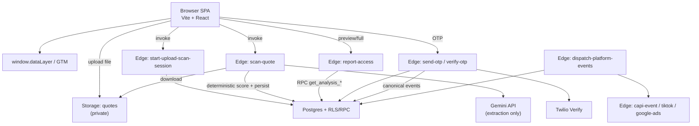

# WindowMAN

> "WindowMan is a forensic quote-intelligence platform that audits residential window estimates against localized market data, exposing price gaps and routing high-intent, verified homeowners to a vetted contractor network.

WindowMan is a tool designed to help homeowners who are buying new windows. When a homeowner receives a price estimate from a window company, they upload it to the platform. The system then acts like a financial detective to see if the price is actually fair.

Building from there
The platform works in three simple steps. First, it reads the estimate line by line. Second, it compares those numbers to actual market prices in the homeowner's specific zip code or city. Third, it points out exactly where the homeowner is being overcharged. Once the homeowner sees the truth about their quote, WindowMan connects them with a trusted, pre-approved contractor who can offer a fair deal.

Key insights
The key insight is that everyday buyers lack the data to know if a window quote is a ripoff. By providing instant, localized data, the platform shifts the power back to the buyer and turns a confused shopper into a highly motivated customer for the partner contractor.

Common misconceptions
A common misconception is that WindowMan manufactures or installs windows. It does not. It is strictly a software platform and a matchmaker that sits between the buyer and the installer.

Why this matters
Replacing windows is a major home expense, and the industry is known for confusing contracts and hidden markups. This tool protects consumers from predatory pricing while rewarding honest, local contractors with high-quality leads.

Check your understanding
You'll know you understand when you can explain that WindowMan's main product is not the windows themselves, but rather the transparency and trust it provides to the transaction.

**Grounded in `forensic_report_v2` at commit `a83283a7cc0162eaaeaacad189691ad805aba81a`.**

The repository implements a browser-based acquisition and report-reveal funnel backed by Supabase Postgres, private Storage, and Deno Edge Functions. Homeowners upload quote files, receive a backend-gated preview, verify by SMS OTP, and only then receive authorized full report data. Deterministic TypeScript scoring runs server-side; Gemini is used for document extraction only.

---

## README Purpose and Authority

This README is a **derived, commit-pinned onboarding map** for developers, operators, security reviewers, and AI coding agents.

| Audience | Use this README to… |
|---|---|
| Developers | Find entry points, run commands, trace call chains, avoid unsafe edits |
| Operators | Understand runtime boundaries, env contracts, and what is frozen vs active |
| Security reviewers | Locate authorization gates, private assets, and service-role boundaries |
| AI agents | Ground changes in executable evidence rather than speculative docs |

**Authority order:**

1. Executable code, SQL migrations, runtime configuration, and generated types at the pinned SHA
2. Commands actually executed during this audit (labeled separately)
3. This README

This README is **not** a product roadmap, marketing deck, deployment-state oracle, or substitute for migrations or Edge Function contracts. Speculative or historical markdown elsewhere in the repo is not represented here as implementation.

Deployed production behavior is **(unknown from repository evidence)** unless independently verified outside this audit.

---

## Quick Navigation

- [Current Repository Reality](#current-repository-reality)
- [Implemented Product Flow](#implemented-product-flow)
- [Architecture](#architecture)
- [Core Stack](#core-stack)
- [Repository Layout](#repository-layout)
- [Routing](#routing)
- [Canonical Data Flow](#canonical-data-flow)
- [Report Access and Security Contract](#report-access-and-security-contract)
- [Supabase Architecture](#supabase-architecture)
- [Edge Function Inventory](#edge-function-inventory)
- [AI and Deterministic Analysis Boundary](#ai-and-deterministic-analysis-boundary)
- [CRM, Lead Dispatch, and Disposition](#crm-lead-dispatch-and-disposition)
- [Tracking and External Integrations](#tracking-and-external-integrations)
- [Environment Configuration](#environment-configuration)
- [Local Development](#local-development)
- [Available Commands](#available-commands)
- [Testing](#testing)
- [Deployment and Runtime Boundaries](#deployment-and-runtime-boundaries)
- [Known Repository Inconsistencies](#known-repository-inconsistencies)
- [Common Failure Modes](#common-failure-modes)
- [Architectural Non-Assumptions](#architectural-non-assumptions)
- [Change-Safety Boundaries](#change-safety-boundaries)
- [README Maintenance Contract](#readme-maintenance-contract)
- [Evidence and Audit Notes](#evidence-and-audit-notes)
- [Operating Principles](#operating-principles)

---

## Current Repository Reality

| Field | Value |
|---|---|
| Repository | `https://github.com/Mongoloyd/wm-mvp` |
| Audited ref | `forensic_report_v2` |
| Pinned SHA | `a83283a7cc0162eaaeaacad189691ad805aba81a` |
| Audit date | 2026-07-20 |
| Manifest size | 1,335 tracked files at pinned SHA |
| Frontend runtime | Vite 7 + React 18 + TypeScript 5.8 (`package.json`) |
| Edge runtime | Deno (Supabase Edge Functions under `supabase/functions/`) |
| Package manager evidence | Dual lockfiles: `package-lock.json` and `bun.lock`; scripts mix `npm`/`npx` and `bunx` |
| Frontend dev URL | `http://localhost:8080` (`vite.config.ts`: `server.port = 8080`) |
| Playwright default URL | `http://localhost:5173` unless `PLAYWRIGHT_BASE_URL` or `BASE_URL` is set (`playwright.config.ts`) — **does not match Vite dev port** |
| Canonical report route | `/report/classic/:sessionId` |
| Compatibility redirect | `/report/:sessionId` → `/report/classic/:sessionId` (`App.tsx`) |
| Canonical analysis table | `public.analyses` |
| Legacy analysis table | `public.quote_analyses` — present in schema/types; **not runtime-referenced** in application TypeScript at this SHA |
| Private quote storage bucket | `quotes` (private; anon INSERT/UPDATE allowed; anon SELECT removed) |
| Canonical reports table | **(absent)** — report payloads live on `analyses.preview_json` / `analyses.full_json` |
| Homeowner auth routes `/signin`, `/signup`, `/vault` | **(absent)** from `App.tsx` route table |
| Deployed state | **(unknown from repository evidence)** |

---

## Implemented Product Flow

### Primary homeowner funnel (verified)

1. **Landing / acquisition** — `/` renders `src/pages/Index.tsx` with `TruthGateFlow`, optional contact capture, and upload/report states.
2. **Lead capture** — `capture-truth-gate-lead` Edge Function via `src/services/truthGateLeadCapture.ts` (and related capture services) creates/updates `leads` without setting `phone_verified`.
3. **Quote upload** — `src/components/UploadZone.tsx` uploads to private bucket `quotes`, then invokes `start-upload-scan-session` and `scan-quote`.
4. **Scan + analysis** — `scan-quote` downloads the private file, calls Gemini for extraction, runs deterministic scoring/flagging, persists to `analyses`, updates `scan_sessions`.
5. **Preview** — browser calls `report-access` mode `preview` → RPC `get_analysis_preview`; frontend strips/withholds sensitive fields (`useAnalysisData.ts`).
6. **OTP gate** — `usePhonePipeline("validate_and_send_otp")` → `send-otp` / `verify-otp` (Twilio Verify server-side).
7. **Full reveal** — after OTP, `fetchFull(phoneE164)` → `report-access` mode `full` → RPC `get_analysis_full` with strict scan-session + phone binding.
8. **Post-reveal actions** — contractor brief / callback requests via `generate-contractor-brief`, `request-callback`; partner disposition is separate admin/partner workflow.

### Alternate / parallel surfaces (verified)

| Surface | Route / module | Role |
|---|---|---|
| In-page homepage report | `PostScanReportSwitcher` on `/` | Dark V2 partial/full UI with OTP gate inline |
| Standalone classic report | `/report/classic/:sessionId` → `ReportClassic.tsx` | Same OTP + `useAnalysisData` pattern |
| Paid-search / LP landings | `/quote-check`, `/window-prices`, `/window-price-audit`, `/truth-report`, `/ai-demo`, `/lp/:slug` | Acquisition variants |
| Nextdoor presell | `/nextdoor` | Native-lead oriented landing |
| Diagnosis funnel | `/diagnosis`, `/estimate` | Separate intake paths with backend persistence functions |
| Admin operator console | `/admin/*` | Lead inbox, routing, dispatch inspection, OTP ops |
| Partner portal | `/partner/*` | Contractor login, opportunities, dossier, revenue |
| Visual / sandbox QA | `/visual/*`, `/sandbox/*` (dev-gated), `/admin/lab/*` | Mock-only or QA harnesses |

### Incomplete, frozen, or dev-only systems (verified)

| System | State at pinned SHA |
|---|---|
| Automatic CRM webhook delivery | **Frozen** by migration `20260716165508_atomic_phase0a_crm_freeze.sql` (`fire_crm_handoff` no-op; `claim_pending_deliveries` returns zero rows) |
| Google Ads conversion dispatch | **Dry-run only** in worker code |
| TikTok conversion dispatch | **Dry-run only** in worker code |
| `nextdoor-capi-event` Edge Function | Code present; **missing** from `supabase/config.toml` |
| `test:e2e:scanner-smoke` npm script | **Placeholder** (`echo "TODO: …"`) |
| Dev report unlock | `dev-report-unlock` + browser `localStorage` dev secret — **development-only** |
| Admin auth in dev | `AdminAuthGate` bypasses session checks when `import.meta.env.DEV` |

---

## Architecture



Only relationships with executable call paths at the pinned SHA are shown. Deployed scheduling of workers/cron is **(unknown from repository evidence)**.

---

## Core Stack

| Area | Technology | Version / evidence | Runtime role |
|---|---|---|---|
| UI framework | React | `^18.3.1` (`package.json`) | Browser SPA |
| Routing | React Router DOM | `^6.30.1` | Client routes/guards |
| Build tool | Vite | `^7.3.2` | Dev server, production bundle |
| Styling | Tailwind CSS + shadcn/Radix | `tailwindcss ^3.4.17`, Radix packages | UI components |
| Client state | Zustand, TanStack Query | `zustand ^5.0.12`, `@tanstack/react-query ^5.83.0` | Funnel + server-state |
| Database | Supabase Postgres | migrations under `supabase/migrations/` | Canonical persistence |
| Auth | Supabase Auth | `@supabase/supabase-js ^2.99.2` | Admin/partner sessions |
| Object storage | Supabase Storage | bucket `quotes` | Private quote files |
| Edge compute | Supabase Edge Functions (Deno) | 58 function entrypoints | Scanner, OTP, reveal proxy, dispatch |
| SMS OTP | Twilio Verify | `send-otp`, `verify-otp` | Phone verification gate |
| Document AI | Gemini | `GEMINI_API_KEY` in `scan-quote` | OCR/extraction only |
| Unit tests | Vitest | `^4.1.0` | Frontend/service tests |
| E2E tests | Playwright | `^1.57.0` | Browser flows |
| Edge lint/typecheck | Deno | CI workflows | Function static analysis |

---

## Repository Layout

Architecturally important paths only:

| Path | Purpose |
|---|---|
| `src/App.tsx` | Top-level public/dev route table |
| `src/pages/Index.tsx` | Canonical homepage acquisition + inline report shell |
| `src/pages/ReportClassic.tsx` | Standalone classic report + OTP gate |
| `src/components/UploadZone.tsx` | Private upload, session bootstrap, scan invocation |
| `src/components/post-scan/PostScanReportSwitcher.tsx` | Homepage post-scan report renderer |
| `src/hooks/useAnalysisData.ts` | Preview/full fetch orchestration |
| `src/hooks/usePhonePipeline.ts` | OTP pipeline modes |
| `src/services/reportService.ts` | `report-access` / RPC transport |
| `src/services/phoneVerificationService.ts` | Sole browser OTP transport |
| `src/routes/AdminRoutes.tsx` | Nested admin routes + `AdminAuthGate` |
| `src/routes/PartnerRoutes.tsx` | Nested partner routes + `PartnerGuard` |
| `src/integrations/supabase/client.ts` | Browser Supabase client (publishable key only) |
| `src/integrations/supabase/types.ts` | Generated DB types (secondary schema evidence) |
| `src/lib/trackEvent.ts` | Operational telemetry → `event_logs` |
| `src/lib/trackConversion.ts`, `src/lib/tracking/` | Business events → `window.dataLayer` |
| `supabase/functions/scan-quote/` | Scanner brain orchestrator |
| `supabase/functions/report-access/` | Service-role reveal proxy |
| `supabase/functions/send-otp/`, `verify-otp/` | Twilio OTP |
| `supabase/functions/start-upload-scan-session/` | Upload/session bootstrap |
| `supabase/functions/dispatch-lead/` | CRM webhook dispatcher (queue frozen) |
| `supabase/functions/dispatch-platform-events/` | Paid-media dispatch worker entry |
| `supabase/migrations/` | Chronological schema/RPC/RLS source of truth |
| `supabase/config.toml` | Local function JWT settings (all listed functions `verify_jwt = false`) |
| `.github/workflows/` | CI guardrails (lint, typecheck, Deno checks, migration integrity) |

---

## Routing

Route classification is from executable router composition at the pinned SHA. **Production-eligible** means not gated by `import.meta.env.DEV` in inspected routing code. It does **not** prove deployment.

### Public production-eligible

| Path | Component / behavior |
|---|---|
| `/` | `Index` |
| `/quote-check` | `PricingSearchLanding` |
| `/window-prices` | `WindowPricesLanding` |
| `/window-price-audit` | `WindowPriceAuditLanding` |
| `/truth-report` | `TruthReportLanding` |
| `/ai-demo` | `AiDemoLanding` |
| `/lp/:slug` | `LandingPage` |
| `/estimate` | `Estimate` |
| `/diagnosis` | `Diagnosis` |
| `/report/classic/:sessionId` | `ReportClassic` |
| `/visual/report-preview` | `DevReportPreview` (mock QA; unlisted) |
| `/visual/pre-upload-intake` | `VisualPreUploadIntake` |
| `/visual/intake-preview` | `WindowManIntakePreview` |
| `/contractors3` | `Contractors3` |
| `/about`, `/contact`, `/faq`, `/privacy`, `/terms`, `/disclaimer`, `/how-we-beat-window-quotes`, `/contractors`, `/contractors2` | Static pages via `PublicLayout` |
| `/nextdoor` | `NextdoorHome` |
| `/windowman` | `WindowManLanding` |
| `/admin/login`, `/admin/forgot-password`, `/admin/reset-password`, `/admin/health` | Public admin auth/health |
| `/partner/login`, `/partner/join`, `/partner/reset-password`, `/partner/accept-invite` | Public partner auth/invite |

### Authenticated / guarded production-eligible

| Path | Guard | Notes |
|---|---|---|
| `/admin/*` (except public auth/health above) | `AdminAuthGate` | Production requires Supabase session; **DEV bypasses gate entirely** |
| `/admin/settings`, `/admin/partners` | `AdminAuthGate` + page-level `AuthGuard` | Double guard |
| `/partner/portal`, `/partner/opportunities`, `/partner/revenue`, `/partner/dossier/:id?` | `PartnerGuard` via layout | Requires auth + active `contractor_profiles` row |
| `/partner/onboarding` | `PartnerGuard` inside page export | Route element itself is public |

### Compatibility / redirect

| Path | Target |
|---|---|
| `/report/:sessionId` | `/report/classic/:sessionId` |

### Development-only (`import.meta.env.DEV`)

| Path | Behavior |
|---|---|
| `/dev/report-preview` | `DevReportPreview` |
| `/devtesting` | `DevTesting` |
| `/dialer` | redirect → `/admin/dialer` |
| `/settings` | redirect → `/admin/settings` |
| `/partners` | redirect → `/admin/partners` |
| `/:devAdminAlias` | redirect → `/admin/:devAdminAlias` when alias is valid admin tab |
| `/sandbox/report-preview` | `DevReportPreview` |
| `/sandbox/intake` | `PreUploadIntake` |

### Sandbox / visual QA

| Path | Gate |
|---|---|
| `/visual/*` | Always routed; mock/QA harness |
| `/admin/lab/report-preview`, `/admin/lab/devtesting` | Behind `AdminAuthGate` in production |

### Fallback

| Path | Component |
|---|---|
| `*` | `NotFound` |

---

## Canonical Data Flow

### 1. Intake / lead identity

- Browser session id + attribution captured in funnel state (`src/state/scanFunnel`, UTM helpers).
- Lead rows created/updated via Edge Functions such as `capture-truth-gate-lead`, `qualify-homepage-lead`, `ingest-native-lead`, and upload bootstrap in `start-upload-scan-session`.
- **`client_slug` must not be NULL** on lead creation paths inspected in capture/upload functions.
- Tables: `leads`, optional `lead_attribution_details`, `lead_events`, `lead_activity` spine (later migrations).

### 2. Private upload

- `UploadZone.tsx` builds deterministic storage path via `src/components/uploadZone/storagePath.ts`.
- File uploaded to **`quotes`** bucket (private).
- Browser does **not** receive durable signed read URLs for unrestricted quote browsing on the happy path.

### 3. Quote-file registration

- `start-upload-scan-session` validates storage path prefix, verifies object exists, upserts `quote_files`.

### 4. Scan session

- Same function upserts `scan_sessions` linked 1:1 to `quote_file_id`.
- Returns `{ scan_session_id, quote_file_id, lead_id }`.

### 5. Scanner invocation

- Browser invokes **`scan-quote`** with `scan_session_id`.
- Function loads session/file context from Postgres, downloads from `quotes`.

### 6. AI extraction

- Gemini HTTP call built in `supabase/functions/scan-quote/index.ts` using `supabase/functions/_shared/scannerConfig.ts`.
- Output normalized/parsed via `geminiJson.ts`; classification gate in `classificationGate.ts`.

### 7. Deterministic scoring / metrics / flags

- `supabase/functions/scan-quote/scoring.ts` — grade + pillar math.
- `flagging.ts` — red flags.
- `../_shared/metrics.ts` — derived financial metrics.
- `reportCompiler.ts` — preview/full payload assembly.

### 8. Persistence

- Upsert into **`analyses`** with `preview_json`, `full_json`, `grade`, `flags`, `analysis_status`, etc.
- Update `scan_sessions.status`.
- Legacy **`quote_analyses`** is not written by inspected runtime paths.

### 9. Preview retrieval

- `useAnalysisData` → `reportService.fetchAnalysisPreview` → Edge **`report-access`** `{ mode: "preview" }` → RPC **`get_analysis_preview`**.
- Frontend preview builder intentionally withholds full flag payloads/count reconstruction beyond allowed preview fields.

### 10. OTP

- `usePhonePipeline` → `phoneVerificationService.sendOtp` / `verifyOtp`.
- Edge functions persist **`phone_verifications`** bound to **`scan_session_id`**; update `leads.phone_verified*`.

### 11. Full authorization / reveal

- `fetchFull(phoneE164)` → **`report-access`** `{ mode: "full", phone_e164 }` → RPC **`get_analysis_full`**.
- DB function returns sentinel `grade = '__UNAUTHORIZED__'` when phone/session binding fails.
- Browser resume uses `localStorage` key `wm_verified_access` (24h TTL) only as a **resume hint**; backend still re-checks on fetch.

### 12. Downstream CRM / contractor actions (where verified)

- **Lead routing:** `admin-route-lead` → RPC `admin_route_lead_assignment`; UI in `src/services/leadAssignments.ts`.
- **Contractor opportunities:** `generate-contractor-brief` writes/reads `contractor_opportunities`.
- **Partner disposition:** `partner-update-disposition` updates `contractor_outcomes`, may emit canonical `sold`.
- **CRM webhook delivery:** `dispatch-lead` exists but queue claim path is frozen (see CRM section).

---

## Report Access and Security Contract

### Preview access (allowed before OTP)

- Mode: `report-access` → `get_analysis_preview`.
- Returns redacted preview fields only; function and frontend both treat `full_json` as forbidden in preview mode.

### Full access (requires backend authorization)

- Mode: `report-access` → `get_analysis_full(p_scan_session_id, p_phone_e164)`.
- Authorization requires a **verified** `phone_verifications` row matching both phone and scan session, joined to consistent `scan_sessions` / `leads` verification state (migration `20260428120000_restore_get_analysis_full_strict_scan_binding.sql`).
- Unauthorized responses are `{ authorized: false, locked: true }`; not a silent preview fallback.

### What is **not** authorization

| Mechanism | Verdict |
|---|---|
| CSS hiding / locked overlays | UX only |
| Disabled buttons | UX only |
| React route visibility | UX only |
| `localStorage` (`wm_verified_access`, `wm_client_slug`, dev secret) | Resume/dev convenience only |
| `useReportAccess()` hook | Mirrors fetch state only |

### OTP binding rules (verified)

- `send-otp` stores pending verification with optional/required session binding.
- `verify-otp` rejects cross-session pending rows when a session id is supplied.
- One verified phone/session pair does **not** automatically authorize unrelated scan sessions unless backend RPC logic explicitly allows it (strict binding enforced in `get_analysis_full`).

### Dev bypass (development-only)

- Browser: `src/lib/devSecret.ts` (`localStorage.wm_dev_secret`) + `import.meta.env.DEV`.
- Server: `dev-report-unlock` checks `DEV_BYPASS_ENABLED` / `DEV_BYPASS_SECRET`.
- Valid production phone path always takes precedence over dev bypass in `useAnalysisData.ts`.

### Service-role boundary

- Browser client uses publishable/anon key only (`src/integrations/supabase/client.ts`).
- Gated RPCs (`get_analysis_preview`, `get_analysis_full`) are invoked **only** through service-role Edge Functions such as `report-access`.
- No browser exposure of `SUPABASE_SERVICE_ROLE_KEY` was found in frontend bundles.

---

## Supabase Architecture

### Important current tables (runtime-referenced)

| Table | Role |
|---|---|
| `leads` | Persistent lead identity, verification timestamps, attribution |
| `scan_sessions` | Per-scan identity linked to quote file |
| `quote_files` | Private storage pointer + status |
| `analyses` | Canonical analysis artifacts (`preview_json`, `full_json`, grade, flags) |
| `phone_verifications` | OTP lifecycle + scan binding |
| `event_logs` | Operational telemetry (anon insert policy) |
| `wm_event_log` | Canonical business/conversion ledger |
| `wm_platform_dispatch_log` | Paid-media dispatch outbox |
| `webhook_deliveries` / `webhook_delivery_attempts` | CRM delivery queue (frozen producer/claim) |
| `lead_assignments` | Admin routing assignments |
| `contractor_profiles`, `contractors` | Partner identity/marketplace records |
| `contractor_opportunities`, `contractor_outcomes` | Sales pipeline + disposition |
| `contractor_unlocked_leads`, `billable_intros` | Monetization/unlock bridge |
| `user_roles` | Admin RBAC lookup |

### Important RPCs

| RPC | Access pattern |
|---|---|
| `get_scan_status` | Browser-safe polling |
| `get_scan_session_context`, `get_upload_retry_context`, `get_lead_context_for_session` | Browser-safe funnel hydration |
| `get_analysis_preview`, `get_analysis_full` | **Service-role / Edge only** |
| `get_lead_by_session` | Edge/bootstrap helpers |
| `admin_route_lead_assignment` | Admin Edge + UI |
| `claim_pending_deliveries` | Returns zero rows (CRM freeze) |
| `wm_claim_dispatch_rows` / scoped variant | Dispatch worker claim |
| `unlock_contractor_lead` | Contractor unlock Edge Function |

### Private storage

- Bucket: **`quotes`**
- Private (`public = false` after early migration)
- Anonymous upload path exists; anonymous read of objects is not policy-permitted.

### RLS / grants (high level)

- Many sensitive tables moved to service-role-only access in late migrations (e.g. `20260518140000_enable_rls_revoke_client_access_service_only_tables.sql`).
- `event_logs` allows anonymous INSERT for telemetry; not a substitute for conversion truth.
- SECURITY DEFINER functions implement reveal, routing, dispatch claim, and admin operations.

### Legacy / compatibility schema objects

| Object | Status at SHA |
|---|---|
| `quote_analyses` | Legacy table retained; service-role policies; **no app runtime reads/writes** |
| `public.profiles` | **(absent)** — use `contractor_profiles` |
| `public.reports` | **(absent)** |
| `/vault/*` route strings | Appear in tests/tracking fixtures only; **no browser routes** |

### Function/config mismatches

| Issue | Detail |
|---|---|
| `nextdoor-capi-event` | Has `index.ts`; **no** `[functions.nextdoor-capi-event]` block in `supabase/config.toml` |
| All configured functions | `verify_jwt = false` in `config.toml` — **does not imply public access**; each function performs its own auth (secrets, service-role internal calls, admin session checks, etc.) |

---

## Edge Function Inventory

58 functions with `index.ts` at the pinned SHA. Grouped by role:

### Scan / report

| Function | Authorization notes |
|---|---|
| `scan-quote` | Service-role internal; scans private `quotes` objects |
| `start-upload-scan-session` | Service-role bootstrap; optional contact-owned upload gate |
| `report-access` | Publicly invokable endpoint, but delegates to gated RPCs; no service key returned |
| `compare-quotes`, `calculate-estimate-metrics` | Service-role analysis helpers |
| `send-report-email` | Server-side email; requires mail secrets |
| `dev-report-unlock` | Dev secret gated |
| `dev-create-quote-scenario` | Dev/QA helper |

### OTP / access

| Function | Authorization notes |
|---|---|
| `send-otp` | Rate limits + Twilio; binds pending verification to scan session when provided |
| `verify-otp` | Twilio check + DB stamp + canonical events |

### Intake / lead capture

| Function | Notes |
|---|---|
| `capture-truth-gate-lead` | Primary browser lead capture |
| `capture-arbitrage-lead`, `capture-power-tool-demo-lead` | Alternate capture paths |
| `qualify-homepage-lead` | Homepage qualification |
| `persist-diagnosis-start`, `submit-diagnosis-intake` | Diagnosis funnel |
| `ingest-native-lead` | Shared-secret header; Nextdoor provider active |
| `import-facebook-lead-ad` | Shared-secret import |
| `enrich-lead`, `update-homeowner-context` | Lead enrichment/update |

### CRM / dispatch

| Function | Notes |
|---|---|
| `dispatch-lead` | `x-dispatch-secret`; queue claim **frozen empty** |
| `admin-route-lead` | Admin auth |
| `admin-materialize-dispatch-outbox`, `admin-simulate-dispatch-attempt` | Operator tooling |
| `send-contractor-handoff` | Handoff notifications |
| `process-webhook` | External webhook processor |

### Admin

| Function | Examples |
|---|---|
| `admin-data`, `admin-sync-revenue-signals`, `admin-contractor-performance`, `admin-client-platform-config` | Operator APIs |
| `dial-lead`, `unlock-lead`, `voice-followup`, `lead-reactivation` | Ops automation |

### Partner / contractor

| Function | Examples |
|---|---|
| `accept-invite`, `request-partner-access` | Partner onboarding |
| `list-contractor-opportunities`, `get-contractor-dossier`, `get-contractor-document-url` | Portal data |
| `contractor-actions`, `contractor-submit-outcome`, `partner-update-disposition` | Disposition + billing |
| `contractor-booking-confirmed`, `contractor-mark-no-show`, `contractor-send-followups` | Follow-up automation |
| `generate-contractor-brief`, `generate-negotiation-script`, `request-callback` | Homeowner/partner workflows |

### Tracking / conversion

| Function | Notes |
|---|---|
| `capi-event` | Internal Meta sender; called by dispatch worker |
| `tiktok-capi-event` | Internal; worker forces dry-run at SHA |
| `google-ads-conversion-event` | Dry-run only |
| `nextdoor-capi-event` | Present in code; config omission noted above |
| `dispatch-platform-events` | Worker entry; requires `DISPATCH_WORKER_SECRET` |
| `qa-google-attribution-event` | QA helper |

### Webhooks / external automation

| Function | Notes |
|---|---|
| `stripe-webhook` | Stripe signature verification |
| `create-checkout-session` | Stripe checkout |
| `refresh-benchmarks`, `contractor-send-followups`, `contractor-performance-summary` | Cron/secret gated jobs |

### Other

| Function | Notes |
|---|---|
| `windowman-concierge` | Gemini-backed concierge endpoint |
| `save-routing-preferences` | Routing prefs persistence |

---

## AI and Deterministic Analysis Boundary

| Stage | System | Module / function |
|---|---|---|
| Reads document bytes | Gemini via `scan-quote` | `index.ts` + `_shared/scannerConfig.ts` |
| Parses/normalizes model JSON | TypeScript validation | `geminiJson.ts`, extraction validators in `scan-quote` |
| Classifies readability/mismatch | TypeScript gate | `classificationGate.ts` |
| Calculates grades/pillars | Deterministic TS | `scoring.ts` |
| Detects flags | Deterministic TS | `flagging.ts` |
| Computes financial metrics | Deterministic TS | `_shared/metrics.ts` |
| Compiles preview/full payloads | Deterministic TS | `reportCompiler.ts` |
| Persists analysis | Edge orchestrator | upsert `analyses` in `scan-quote/index.ts` |
| Renders preview/full | Frontend | `useAnalysisData.ts` + report components |

**Verified rule at this SHA:** AI extracts evidence; TypeScript assigns scores/flags/grades; backend persists; frontend renders authorized payloads only.

The browser does **not** call Gemini directly.

---

## CRM, Lead Dispatch, and Disposition

Three layers must stay separate:

### Lead lifecycle (`leads`, `lead_events`, activity spine)

- Creation via capture/upload/diagnosis/native ingest functions.
- Verification state on `leads.phone_verified_at`.
- Admin disposition fields added in later migrations.

### Delivery / dispatch state (`webhook_deliveries`, `dispatch-lead`, routing RPCs)

- **Phase 0A freeze (latest relevant migration):**
  - `fire_crm_handoff()` trigger function is a no-op.
  - `claim_pending_deliveries()` returns zero rows.
  - Cron job `dispatch-lead-every-minute` unscheduled when present.
- `dispatch-lead` Edge Function remains in repo but cannot drain a queue at this schema state.

### Contractor sales outcome / disposition (`contractor_outcomes`, partner/admin tools)

- Partners update outcomes via `partner-update-disposition`.
- Operators intervene via `contractor-actions`.
- Sold signals may write canonical `sold` events to `wm_event_log` for measurement; not the same as CRM webhook delivery.

### Paid-media dispatch (separate system)

- Canonical events land in `wm_event_log` / `wm_platform_dispatch_log`.
- Worker: `dispatch-platform-events` → platform senders (`capi-event`, etc.).
- Scheduling/triggering in production: **(unknown from repository evidence)**.

---

## Tracking and External Integrations

### Browser measurement (business lane)

- GTM container **`GTM-K3M99HSM`** bootstrapped in `index.html`.
- Emitters: `src/lib/trackConversion.ts`, `src/lib/tracking/dataLayer.ts`, `AppTrackingProvider.tsx`.
- Meta browser pixel limited to PageView seeding (`src/lib/metaBrowserPixel.ts`).
- **No browser calls** to `capi-event`, `tiktok-capi-event`, or `google-ads-conversion-event`.

### Server conversion dispatch

- Producers: `verify-otp`, `scan-quote`, conditional `capture-truth-gate-lead`, `qualify-homepage-lead`, `partner-update-disposition`.
- Canonical writer: `supabase/functions/_shared/tracking/canonical/createCanonicalEvent.ts`.
- Worker sender: `dispatch-platform-events`.
- Meta live sender: `capi-event`.
- TikTok/Google: dry-run enforced in worker at this SHA.

### Operational telemetry

- `src/lib/trackEvent.ts` → `event_logs` (OTP errors, preview rendered, upload failures, etc.).
- Not equivalent to paid-media truth unless explicitly bridged by canonical pipeline.

### Communication APIs

| Provider | Path |
|---|---|
| Twilio Verify | `send-otp`, `verify-otp` |
| Resend email | `send-report-email`, contractor mailers |
| Stripe | `create-checkout-session`, `stripe-webhook` |

### Webhooks / native ingest

| Entry | Auth |
|---|---|
| `ingest-native-lead` | `NATIVE_LEAD_INGEST_SECRET` |
| `import-facebook-lead-ad` | import secret |
| `process-webhook` | cron/shared secret pattern |

### AI providers

| Provider | Where |
|---|---|
| Gemini | `scan-quote`, `windowman-concierge` |

---

## Environment Configuration

Names and purposes only. **Never commit secret values.**

### Browser-visible (`import.meta.env` / `VITE_*`)

| Variable | Subsystem | Required? | Purpose |
|---|---|---|---|
| `VITE_SUPABASE_URL` | Supabase client | **Required** | Project URL; missing throws in client bootstrap |
| `VITE_SUPABASE_PUBLISHABLE_KEY` | Supabase client | **Required*** | Browser key (*or `VITE_SUPABASE_ANON_KEY` alias) |
| `VITE_SUPABASE_ANON_KEY` | Supabase client | Optional alias | Acceptable alternate publishable key name |
| `VITE_META_PIXEL_ID` | Meta pixel | Optional | Skips/init guards when absent/test id |
| `VITE_AUTH_GUARD_DEV_BYPASS` | AuthGuard | Optional | Dev-only bypass when `"true"` |
| `VITE_ENABLE_DARK_V2_HOMEPAGE` | Homepage resume | Optional | Enables Dark V2 return resume branch in `Index.tsx` |
| `VITE_ARBITRAGE_PROGRESSIVE_CAPTURE` | Feature flag | Optional | Progressive capture |
| `VITE_INTAKE_ROUTER_ENABLED` | Feature flag | Optional | Intake router |
| `VITE_NEXTDOOR_CAPI_ENABLED` | Dispatch eligibility | Optional | Nextdoor dispatch flag |
| `VITE_TIKTOK_CAPI_ENABLED` | Dispatch eligibility | Optional | TikTok dispatch flag |
| `DEV` | Vite built-in | Built-in | Dev routes/guards/bypass behavior |

`VITE_SUPABASE_PROJECT_ID` appears in `.env.example` but has **no runtime consumer** at this SHA.

### Server-only / Edge secrets (representative)

| Variable | Subsystem | Required when |
|---|---|---|
| `SUPABASE_URL`, `SUPABASE_SERVICE_ROLE_KEY` | Edge Functions | Most mutating/server paths |
| `SUPABASE_ANON_KEY` | Edge Functions | JWT validation paths |
| `GEMINI_API_KEY` | `scan-quote` | Scanning |
| `TWILIO_ACCOUNT_SID`, `TWILIO_AUTH_TOKEN`, `TWILIO_VERIFY_SERVICE_SID` | OTP | Live SMS |
| `META_PIXEL_ID`, `META_CAPI_TOKEN` | Meta CAPI | Meta dispatch |
| `DISPATCH_WORKER_SECRET` | `dispatch-platform-events` | Worker auth |
| `DISPATCH_LEAD_SECRET` | `dispatch-lead` | CRM dispatcher auth |
| `DEV_BYPASS_ENABLED`, `DEV_BYPASS_SECRET` | Dev/admin bypass | Dev unlock/admin auth bypass |
| `NATIVE_LEAD_INGEST_SECRET` | Native ingest | External lead POST |
| `STRIPE_SECRET_KEY`, `STRIPE_WEBHOOK_SECRET` | Billing | Checkout/webhooks |
| `RESEND_API_KEY` | Email | Mail senders |
| OTP QA vars (`OTP_QA_*`) | QA only | Non-production test bypass |

Full inventory exceeds 75 server-side names across Edge Functions; inspect with repository search on `Deno.env.get` when adding new functions.

### Development / test variables

| Variable | Used by |
|---|---|
| `PLAYWRIGHT_BASE_URL`, `BASE_URL` | Playwright |
| `SITE_URL` | `scripts/generate-sitemap.ts` |
| `SUPABASE_STAGING_DB_URL` | CI migration workflow optional smoke |

---

## Local Development

Verified prerequisites implied by scripts and config:

- Node.js + npm (CI uses `npm ci`; some scripts call `bunx`)
- Optional: Bun (for `bunx tsx` predev/prebuild sitemap generation)
- Optional: Supabase CLI (for `typegen` script)
- Optional: Deno (Edge Function lint/typecheck/tests)
- Supabase project with Edge Functions deployed/secrets configured for end-to-end OTP/scan flows (**environment-specific**)

Sequential commands (from executable scripts only):

```bash
git checkout forensic_report_v2
git rev-parse HEAD   # expect a83283a7cc0162eaaeaacad189691ad805aba81a for this README snapshot

cp .env.example .env.local
# Set VITE_SUPABASE_URL and VITE_SUPABASE_PUBLISHABLE_KEY (or VITE_SUPABASE_ANON_KEY)

npm ci
npm run dev          # predev runs: bunx tsx scripts/generate-sitemap.ts
                     # serves at http://localhost:8080
```

For Playwright against local dev, set:

```bash
set PLAYWRIGHT_BASE_URL=http://localhost:8080   # Windows
# or export PLAYWRIGHT_BASE_URL=http://localhost:8080
```

No package-level database reset/bootstrap command exists in `package.json`. Database setup is via Supabase migrations (`supabase/migrations/`) applied through your Supabase project workflow.

---

## Available Commands

From `package.json` at pinned SHA:

| Script | Command | Lifecycle side effects | Notes |
|---|---|---|---|
| `predev` | `bunx tsx scripts/generate-sitemap.ts` | Runs automatically before `dev` | Requires Bun-compatible runner |
| `dev` | `vite` | After `predev` | Port 8080 |
| `prebuild` | `bunx tsx scripts/generate-sitemap.ts` | Runs automatically before `build` | |
| `build` | `vite build` | After `prebuild` | |
| `build:dev` | `vite build --mode development` | | |
| `preview` | `vite preview` | | |
| `lint` | `eslint .` | | |
| `typecheck` | `tsc --noEmit` | | |
| `test` | `vitest run` | | All Vitest unit/integration tests under `src/**` |
| `test:watch` | `vitest` | | |
| `test:critical` | vitest run on 5 critical files | | OTP/reveal/upload path |
| `test:all` | `vitest run && npx supabase functions test` | | Edge tests require Supabase CLI + Deno toolchain |
| `test:e2e:legacy-golden-thread` | `playwright test tests/golden-thread.spec.ts` | | |
| `test:e2e:scanner-smoke` | `echo "TODO: …"` | | **Placeholder only** |
| `proof:pageview` | `vitest run --config vitest.proof.config.ts` | | PageView dedupe proof |
| `typegen` | `npx supabase gen types typescript --project-id zgsofkgddpcntdvpckdq > src/integrations/supabase/types.ts` | | Writes generated types |
| `typegen:check` | pipes generated types to `diff` | | Unix `diff` dependency |
| `scanner:fixtures` | `bun run scripts/scanner-fixture-report.ts` | | Bun script |

---

## Testing

### Static inventory

| Kind | Count at SHA |
|---|---|
| `*.test.ts` | 88 |
| `*.spec.ts` | 7 |
| `*.test.tsx` | 31 (Vitest-eligible, not in `*.test.ts` count above) |
| Edge Function tests | Present under `supabase/functions/**` (run via Deno / `supabase functions test`) |

Frameworks: **Vitest** (frontend), **Playwright** (e2e), **Deno test** (selected Edge guardrails in CI).

### Executed during this audit (detached worktree at pinned SHA)

| Command | Exit | Result |
|---|---|---|
| `npm ci` | 0 | Dependencies installed in isolated worktree |
| `npm run typecheck` | 0 | Passed |
| `npm run test:critical` | 0 | **5 files, 106 tests passed** |
| `npm run build` | 0 | Production build succeeded |
| `npm run lint` | 1 | **410 problems (301 errors, 109 warnings)** |

### Not executed during this audit

- Full `npm run test`
- `npm run test:all`
- Playwright e2e suite
- Deno Edge Function tests (`deno test`, CI workflows)
- Supabase migration integrity workflow
- Runtime OTP/scan manual verification against a live Supabase project

---

## Deployment and Runtime Boundaries

| Boundary | Implementation evidence | Deployed state |
|---|---|---|
| Browser SPA | Vite build → static assets | **(unknown)** |
| Supabase Auth | Admin/partner sessions | **(unknown)** |
| Postgres + RPC/RLS | migrations + generated types | **(unknown)** |
| Storage `quotes` | private bucket policies | **(unknown)** |
| Edge Functions (Deno) | `supabase/functions/*` | **(unknown)** |
| Service-role credentials | Edge Functions only | Must never ship to browser |
| Twilio / Gemini / Stripe / Meta | External network from Edge | **(unknown)** |
| CRM webhook delivery | Code present; schema frozen | Automatic delivery **disabled at schema level** in repo |
| Dispatch worker cron | Unscheduled for CRM; platform worker trigger **(unknown)** | **(unknown)** |

Repository implementation proves capability exists in code/migrations; it does **not** prove which project/ref is live.

---

## Known Repository Inconsistencies

1. **Playwright base URL vs Vite port** — Playwright defaults to `:5173`; Vite serves `:8080`.
2. **`nextdoor-capi-event` config drift** — Function directory exists; missing from `supabase/config.toml`.
3. **Dark V2 homepage flag split** — `PostScanReportSwitcher.tsx` hardcodes `enableDarkV2Homepage = true`, while `Index.tsx` resume branch keys off `VITE_ENABLE_DARK_V2_HOMEPAGE === "true"`.
4. **Dual lockfiles / package managers** — Both `package-lock.json` and `bun.lock`; CI uses `npm ci` in one workflow and `bun install --frozen-lockfile` in another.
5. **`App.tsx` stale comment vs partner routing** — Comment says PartnerGuard removed; `PartnerRoutes.tsx` still wraps portal routes with `PartnerGuard`.
6. **`upsert_native_lead_with_attribution` RPC vs ingest implementation** — Migration adds RPC; `ingest-native-lead` still uses direct table writes at this SHA.
7. **`/vault/*` strings vs routing** — Appear in tracking/tests and Edge telemetry strings; no homeowner `/vault` routes in `App.tsx`.
8. **Generated types vs legacy tables** — `quote_analyses` remains in types/migrations but canonical runtime uses `analyses`.

---

## Common Failure Modes

Evidence-backed operational failures developers encounter:

| Symptom | Likely cause in code |
|---|---|
| Frontend fails immediately on boot | Missing `VITE_SUPABASE_URL` or publishable key (`src/integrations/supabase/client.ts` throws) |
| Local dev refuses old Supabase ref | DEV guard rejects URL containing `wkrcyxcnzhwjtdpmfpaf` |
| Upload succeeds but scan session missing | `start-upload-scan-session` not invoked or storage path prefix mismatch |
| Preview loads but full stays locked after OTP | Phone/session mismatch in `get_analysis_full`; pending verification bound to different `scan_session_id` |
| OTP send failures | Twilio secrets missing/invalid; rate limit windows in `send-otp` |
| Scan stalls / retry loops | `scan-quote` stale-processing recovery; upload retry context RPC failures |
| Playwright e2e cannot reach app | Wrong base URL (`5173` default vs `8080` dev server) |
| CRM webhook never fires | Expected after Phase 0A freeze — producer/claim intentionally disabled |
| Google/TikTok dispatch appears in logs but not in ad platforms | Dry-run-only senders at worker layer |
| ESLint CI/local friction | `npm run lint` reports hundreds of existing violations at pinned SHA |

---

## Architectural Non-Assumptions

Do **not** assume the following without re-verifying code at your commit:

| Assumption | Forensic verdict at pinned SHA |
|---|---|
| Next.js app router/pages | **(absent)** — Vite SPA only (`next-themes` is unrelated UI theming) |
| Prisma ORM | **(absent)** from dependencies and runtime queries |
| Homeowner `/vault` product routes | **(absent)** from `App.tsx` |
| Canonical `public.reports` table | **(absent)** — use `analyses` |
| Canonical `public.profiles` table | **(absent)** — use `contractor_profiles` / `leads` |
| Browser holds service-role key | **(absent)** in frontend code paths |
| `quote_analyses` is written on scan | **(absent)** runtime writes — canonical is `analyses` |
| Package script resets local DB | **(absent)** in `package.json` |
| `verify_jwt = false` means unauthenticated public data access | **False** — inspect per-function secret/JWT/ownership checks |
| README or other markdown proves runtime behavior | **False** — executable code/SQL wins |

---

## Change-Safety Boundaries

| Subsystem | High-risk locations | Invariant that must remain true |
|---|---|---|
| Verify-to-Reveal | `supabase/functions/report-access/`, RPCs `get_analysis_preview` / `get_analysis_full`, `src/hooks/useAnalysisData.ts`, `src/services/reportService.ts` | `full_json` never authorized without backend phone/session verification |
| OTP binding | `send-otp`, `verify-otp`, `phone_verifications`, `ReportClassic.tsx`, `PostScanReportSwitcher.tsx` | One verified OTP unlocks only its bound scan session |
| Scanner/scoring | `supabase/functions/scan-quote/scoring.ts`, `flagging.ts`, `reportCompiler.ts` | Grades/flags/pillars remain deterministic TS, not LLM output |
| Private quote storage | Storage bucket `quotes`, upload policies, `start-upload-scan-session` | Quote files stay private; no casual anon read paths |
| Migrations / RPC grants | `supabase/migrations/**`, SECURITY DEFINER functions | Do not widen client EXECUTE on gated RPCs |
| Admin authorization | `AdminAuthGate`, admin Edge Functions, `user_roles` checks | Production admin paths must not silently widen to anon |
| Partner authorization | `PartnerGuard`, `usePartnerAuth`, partner Edge Functions | Partner data scoped to authenticated contractor identity |
| CRM dispatch | `fire_crm_handoff`, `claim_pending_deliveries`, `dispatch-lead` | Do not re-enable delivery without explicit approved migration + ops plan |
| Conversion tracking | `createCanonicalEvent.ts`, `dispatch-platform-events`, `capi-event` | Preserve deterministic `event_id`, identity fields, and server-side dispatch boundary |
| Dev bypass | `dev-report-unlock`, `devSecret.ts`, `_shared/adminAuth.ts` | Must remain impossible in production builds/paths |

---

## README Maintenance Contract

Regenerate or manually review this README after material changes to:

- `src/App.tsx` and nested route modules (`src/routes/*`)
- `package.json` scripts/tooling and lockfiles
- `vite.config.ts`, Vitest/Playwright configs
- `supabase/config.toml` and Edge Function inventory/contracts
- `supabase/migrations/**`, RPCs, RLS, storage policies
- Scanner architecture under `supabase/functions/scan-quote/**`
- OTP/report authorization (`send-otp`, `verify-otp`, `report-access`, related RPCs)
- CRM routing/dispatch/disposition modules
- Tracking/canonical event pipeline
- Environment variable contracts (`.env.example`, client bootstrap, Edge env reads)

After code changes, **executable sources remain authoritative**; this README must not silently become the only spec.

---

## Evidence and Audit Notes

| Field | Value |
|---|---|
| Pinned SHA | `a83283a7cc0162eaaeaacad189691ad805aba81a` |
| Audit date | 2026-07-20 |
| Inspected evidence | 1,335-path manifest; `package.json`, lockfiles, Vite/Vitest/Playwright/ESLint configs, CI workflows, `src/App.tsx`, nested routers, core funnel/report hooks/services, `supabase/config.toml`, 58 Edge Function entrypoints, 145 migration files chronologically, generated `src/integrations/supabase/types.ts`, env declarations in executable code |
| Commands executed | `git worktree add --detach`, `npm ci`, `npm run typecheck`, `npm run test:critical`, `npm run build`, `npm run lint` |
| Commands not executed | Full test suite, Playwright e2e, Deno edge tests, migration integrity workflow, live Supabase OTP/scan verification |
| Inaccessible admissible evidence | Live deployed Supabase project state, secret values, production cron/schedulers, external ad platform receipt |
| Unresolved conflicts | Listed in [Known Repository Inconsistencies](#known-repository-inconsistencies) |
| Deployed-state facts | **(unknown from repository evidence)** |
| Material limitations | Audit used immutable `git show`/`git ls-tree` for source truth; existing working-tree `README.md` modifications were not used as evidence |

Major claim source paths are cited inline by repository-relative path throughout this document.

---

## Operating Principles

Verified invariants implemented at the pinned SHA:

1. **AI reads; TypeScript scores.** Gemini extraction in `scan-quote` precedes deterministic grade/flag computation.
2. **Preview before OTP is allowed; full report before backend authorization is not.** `report-access` full mode delegates to strict RPC binding.
3. **Client-side hiding is not authorization.** Route visibility, overlays, and hooks mirror state but do not gate secrets.
4. **Canonical analysis lives in `analyses`.** Preview/full separation is enforced in RPCs and Edge proxy stripping.
5. **Private quotes bucket.** Homeowner uploads go to `quotes`; gated retrieval happens server-side.
6. **OTP verification is server-side via Twilio Edge Functions.** Browser uses `phoneVerificationService` only.
7. **Business conversion events and operational telemetry are separated.** dataLayer/GTM vs `event_logs` vs `wm_event_log`.
8. **CRM automatic delivery is fail-closed at the database layer** in the latest migration at this SHA.
9. **Service-role credentials stay server-side.** Browser Supabase client uses publishable/anon key only.
10. **This README is a snapshot** of `forensic_report_v2 @ a83283a7…` and is not authoritative beyond that commit without regeneration.
