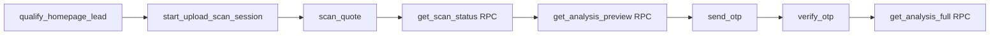

# WindowMan V2 — Backend Diagnosis Report

**Date:** 2026-05-19  
**Scope:** Inspect-only protocol per funnel state machine. No frontend/CORS/OTP/RLS changes.

---

## A) Supabase target verification

| Source | Value |
|--------|--------|
| `supabase/config.toml` `project_id` | `wkrcyxcnzhwjtdpmfpaf` (production ref in repo — **not** proof of active CLI target) |
| `supabase/.temp/project-ref` (linked CLI) | `zgsofkgddpcntdvpckdq` (**staging**) |
| `supabase status` | Local stack running at `http://127.0.0.1:54321` |

**Rule:** Use `--project-ref zgsofkgddpcntdvpckdq` on remote commands unless intentionally targeting production.

```powershell
Get-Content supabase/config.toml
Get-Content supabase/.temp/project-ref
supabase status
supabase link --project-ref zgsofkgddpcntdvpckdq   # if relink needed
```

---

## B) Funnel state machine vs staging reality



| Stage | Endpoint | Deployed on staging? | Local `deno check` |
|-------|----------|--------------------|--------------------|
| 1 Pre-upload | `qualify-homepage-lead` | **NO** | Pass |
| 2 Upload bootstrap | `start-upload-scan-session` | Yes (v6) | Pass |
| 3 Scan | `scan-quote` | Yes (v6) | Pass |
| 4 Poll | `get_scan_status` RPC | N/A (DB) | Exists on linked DB |
| 5 Preview | `get_analysis_preview` RPC | N/A (DB) | Exists on linked DB |
| 6 OTP send | `send-otp` | Yes (v6) | Pass |
| 7 OTP verify | `verify-otp` | Yes (v6) | Pass |
| 8 Full reveal | `get_analysis_full` RPC | N/A (DB) | Exists on linked DB |

**Primary Stage 1 blocker:** `qualify-homepage-lead` exists in repo but is **not deployed** to `zgsofkgddpcntdvpckdq`. Browser invoke → 404/500 → often misreported as CORS.

**Production homepage path today** may use `capture-truth-gate-lead` (deployed) instead of `qualify-homepage-lead` — confirm failing Network request name before fixing.

---

## C) Deno typecheck gate (deployment blocker)

### Funnel functions (pass individually)

```powershell
npx -y deno check supabase/functions/qualify-homepage-lead/index.ts
npx -y deno check supabase/functions/start-upload-scan-session/index.ts
npx -y deno check supabase/functions/scan-quote/index.ts
npx -y deno check supabase/functions/send-otp/index.ts
npx -y deno check supabase/functions/verify-otp/index.ts
npx -y deno check supabase/functions/_shared/adminAuth.ts
```

All funnel targets above: **pass** (deprecation warning on `deno.json` only).

### First failure in full sweep (blocks bulk deploy)

**File:** `supabase/functions/admin-client-platform-config/index.ts`  
**Error:** `TS18046: 'err' is of type 'unknown'` at line 595

Full sweep command (stops at first failure):

```powershell
$ErrorActionPreference = 'Stop'
Get-ChildItem -Recurse supabase/functions -Include *.ts,*.tsx |
  Where-Object { $_.FullName -notmatch 'node_modules' } |
  Sort-Object FullName |
  ForEach-Object {
    Write-Host "Checking $($_.FullName)"
    npx -y deno check $_.FullName
    if ($LASTEXITCODE -ne 0) { throw "Typecheck failed at $($_.FullName)" }
  }
```

**Implication:** Deploying *all* functions in one CI job can fail even when funnel functions are clean. Deploy funnel functions **by name** until shared type errors are fixed.

```powershell
supabase functions deploy qualify-homepage-lead --project-ref zgsofkgddpcntdvpckdq
supabase functions deploy start-upload-scan-session --project-ref zgsofkgddpcntdvpckdq
# ... etc.
```

---

## D) Secrets diff (staging `zgsofkgddpcntdvpckdq`)

Present on staging (names only):

- `SUPABASE_URL`, `SUPABASE_SERVICE_ROLE_KEY`, `SUPABASE_ANON_KEY`
- `TWILIO_ACCOUNT_SID`, `TWILIO_AUTH_TOKEN`, `TWILIO_VERIFY_SERVICE_SID`
- `GEMINI_API_KEY`, `DISPATCH_LEAD_SECRET`

### Missing or likely misconfigured for funnel

| Secret | Required by | Impact if missing |
|--------|-------------|-------------------|
| `TWILIO_LOOKUP_ENABLED` | `qualify-homepage-lead`, `send-otp` (optional lookup) | Qualification fail-closed; lookup skipped on send-otp |
| `DEV_BYPASS_ENABLED` / `DEV_BYPASS_SECRET` | `scan-quote` (dev only) | Dev scanner bypass only — not prod funnel |

Auto-injected by Supabase (do not set manually): `SUPABASE_URL`, `SUPABASE_SERVICE_ROLE_KEY` on Edge Functions.

### Sync commands (operator fills values — never paste into chat)

```powershell
supabase secrets list --project-ref zgsofkgddpcntdvpckdq

supabase secrets set --project-ref zgsofkgddpcntdvpckdq TWILIO_LOOKUP_ENABLED=true
# Optional dev-only:
# supabase secrets set --project-ref zgsofkgddpcntdvpckdq DEV_BYPASS_ENABLED=false
```

---

## E) Per-stage dependency matrix (fake-CORS triage)

### Stage 1 — `qualify-homepage-lead`

- **Body:** `name`, `email`, `phone`, `source`; optional `context`
- **Env:** `SUPABASE_URL`, `SUPABASE_SERVICE_ROLE_KEY`, `TWILIO_ACCOUNT_SID`, `TWILIO_AUTH_TOKEN`, `TWILIO_LOOKUP_ENABLED=true`
- **Tables:** `leads`; canonical bridge → `wm_event_log` / related tracking tables
- **RPCs:** none
- **Storage:** none

### Stage 2 — `start-upload-scan-session`

- **Body:** `session_id` (UUID), `storage_path`, optional `file_name`, `file_size`, `file_type`
- **Env:** `SUPABASE_URL`, `SUPABASE_SERVICE_ROLE_KEY`
- **Tables:** `leads`, `quote_files`, `scan_sessions`, `event_logs`
- **RPC:** `get_lead_by_session`
- **Storage:** bucket `quotes` (private); verifies object via signed URL before DB writes

### Stage 3 — `scan-quote`

- **Body:** `scan_session_id`, optional `event_id`
- **Env:** `SUPABASE_URL`, `SUPABASE_SERVICE_ROLE_KEY`, `GEMINI_API_KEY`
- **Tables:** `scan_sessions`, `quote_files`, `analyses`, `leads`, `lead_events`
- **Storage:** `quotes` bucket read

### Stages 4–5 — RPCs (browser anon key)

- `get_scan_status(p_scan_session_id)`
- `get_analysis_preview(p_scan_session_id)` — no `full_json`, no flags

### Stage 6–7 — `send-otp` / `verify-otp`

- **Body:** `phone_e164`, `scan_session_id`; verify adds `code`
- **Env:** Twilio trio + service role; optional `TWILIO_LOOKUP_ENABLED`
- **Tables:** `phone_verifications`, `leads`, `scan_sessions`

### Stage 8 — `get_analysis_full`

- **Args:** `p_scan_session_id`, `p_phone_e164`
- **Gate:** server re-checks `phone_verified_at` / session binding; may return `grade = '__UNAUTHORIZED__'`

---

## F) Raw runtime logs (Dashboard)

Do not diagnose from browser CORS text alone.

1. Open [Supabase Dashboard](https://supabase.com/dashboard) → project **`zgsofkgddpcntdvpckdq`** (confirm ref in URL).
2. **Edge Functions** → select failing slug (e.g. `qualify-homepage-lead`).
3. **Logs** tab → filter last 15 minutes.
4. Match invocation time to browser Network timestamp.
5. Capture: exception message, stack trace, `Deno.env.get` null errors, Postgres `function ... does not exist`, RLS `42501`.

CLI note: Supabase CLI v2.90.0 does not expose `functions logs`; use Dashboard **Edge Functions → Logs** for raw stack traces.

---

## G) Recommended next fixes (smallest backend-only)

1. **If Network shows `qualify-homepage-lead` failing:** deploy it to staging (funnel typecheck already passes).
2. **Set `TWILIO_LOOKUP_ENABLED=true`** on staging if mobile qualification is required.
3. **Confirm `.env.local`** `VITE_SUPABASE_URL` hostname is `zgsofkgddpcntdvpckdq`, not production.
4. **Do not** rewrite CORS or frontend reveal gates.
5. For bulk deploy CI: fix `admin-client-platform-config/index.ts` TS18046 first, or deploy funnel slugs individually.

---

## Commands executed (this run)

```text
supabase status
supabase functions list --project-ref zgsofkgddpcntdvpckdq
supabase secrets list --project-ref zgsofkgddpcntdvpckdq
supabase db query --linked "<RPC existence query>"
npx -y deno check (funnel functions + first-failure sweep)
```
