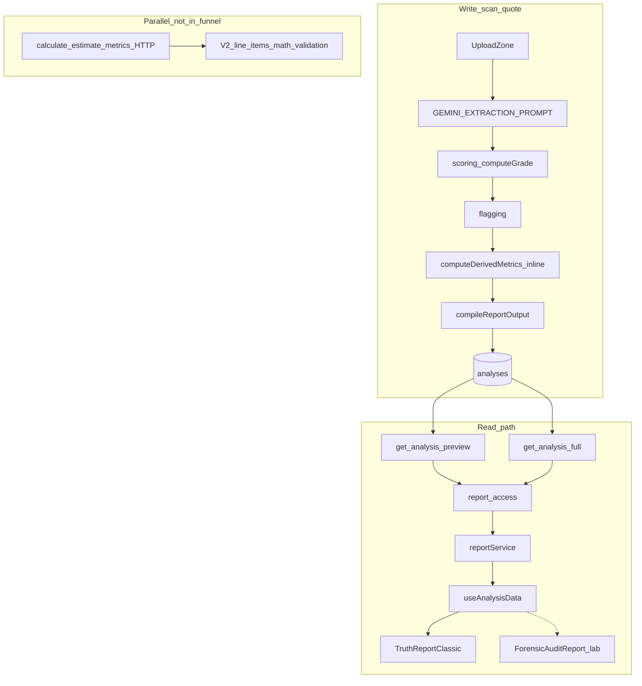
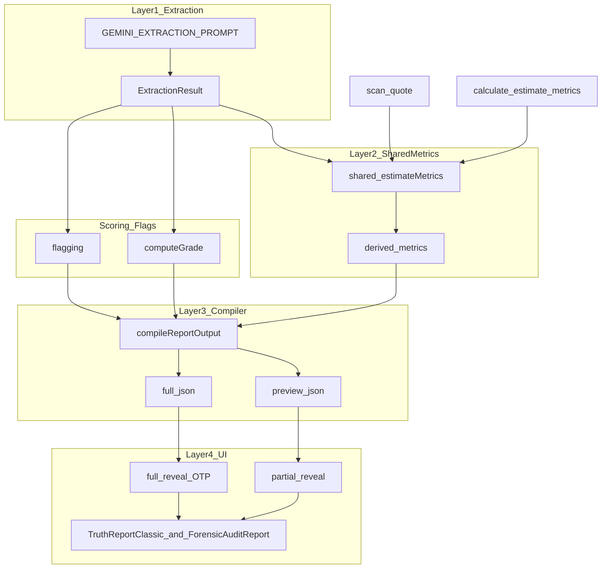

# Scanner Brain — Current vs Target Architecture

**Status:** Phase 0 documentation (architecture lock)  
**Sprint:** `scanner-brain-math-separation`  
**Last verified:** 2026-05-22 against `wm-mvp` repo  

This document locks the **current** scanner/report data path and the **target** four-layer architecture for deterministic math separation. It is the canonical reference for Phases 1–5 of the scanner-brain program.

**Related docs:**

- [`SIGNAL_CONTAINER_MAP.md`](./SIGNAL_CONTAINER_MAP.md) — signal-to-field mapping for Truth Report V2
- [`FORENSIC_PROPS_CONTRACT.md`](./FORENSIC_PROPS_CONTRACT.md) — UI prop contracts vs backend fields
- [`ADR-002-v2-source-transitional-bridge.md`](../adr/ADR-002-v2-source-transitional-bridge.md) — client `v2_source` fallback until Edge projection is stable
- [`phase-0-repo-truth-audit.md`](../sprints/phase-0-repo-truth-audit.md) — repo funnel truth

**Product principle (non-negotiable):**

> Gemini reads the quote. TypeScript calculates the math. Deterministic scoring/flagging judges risk. The report compiler converts results into report-ready language. The frontend renders preview or full report based on **backend authorization** — never CSS blur as a substitute for the gate.

---

## 1. Verified current paths

### 1.1 Write path — `scan-quote` Edge Function

| Component | Path | Role | Inputs | Outputs | Called by | Preview / full |
|-----------|------|------|--------|---------|-----------|----------------|
| **GEMINI_EXTRACTION_PROMPT** | [`supabase/functions/scan-quote/index.ts`](../../supabase/functions/scan-quote/index.ts) (~664+) | Static extraction instructions + JSON schema for Gemini | Uploaded quote file(s) via signed URL | Structured `ExtractionResult` JSON | `scan-quote` handler (~1210) when calling Gemini | Neither directly — feeds downstream pipeline |
| **computeGrade** | [`supabase/functions/scan-quote/scoring.ts`](../../supabase/functions/scan-quote/scoring.ts) | Deterministic letter grade + pillar scores | `ExtractionResult` | `GradeResult` | `scan-quote/index.ts` (~1571) | Both (grade in preview + full) |
| **Flagging** | [`supabase/functions/scan-quote/flagging.ts`](../../supabase/functions/scan-quote/flagging.ts) | Deterministic red/amber flags | `ExtractionResult` | `flags[]` | `scan-quote/index.ts` before compiler | Counts in preview; full array in `full_json` only |
| **computeDerivedMetrics** (inline) | [`supabase/functions/scan-quote/index.ts`](../../supabase/functions/scan-quote/index.ts) (~307–539, Section 4b) | Deterministic financial breakdown + county benchmark | `ExtractionResult`, optional `countyName` from `leads` | `derived_metrics` object | `scan-quote/index.ts` (~1595) | Embedded in **full_json** only |
| **compileReportOutput** | [`supabase/functions/scan-quote/reportCompiler.ts`](../../supabase/functions/scan-quote/reportCompiler.ts) (~390) | Interpretation bridge: warnings, bands, teasers | extraction, grade, flags, `derived_metrics` | `CompiledReportOutput` | `scan-quote/index.ts` (~1620) | **Both** — teasers → `preview_json`; full fields → `full_json` |
| **preview_json writer** | `scan-quote/index.ts` (~1645–1666, upsert ~1706) | Redacted teaser payload | grade, flag counts, compiled teasers | `analyses.preview_json` | `upsertAnalysisRecord` on complete scan | **Preview only** |
| **full_json writer** | `scan-quote/index.ts` (~1668–1690, upsert ~1707) | Complete analysis blob | extraction, flags, derived_metrics, compiler output | `analyses.full_json` | Same upsert | **Full reveal only** (read gated by OTP) |

**Canonical scan invocation:** [`src/components/UploadZone.tsx`](../../src/components/UploadZone.tsx) → `supabase.functions.invoke("scan-quote", …)`.

**Note:** There is no `src/components/report/reveal/` directory in this repo. Dark V2 lives under `src/components/forensic-report/`.

---

### 1.2 Parallel metrics endpoint (not in live funnel)

| Component | Path | Role | Status |
|-----------|------|------|--------|
| **calculate-estimate-metrics** | [`supabase/functions/calculate-estimate-metrics/index.ts`](../../supabase/functions/calculate-estimate-metrics/index.ts) | Standalone POST `{ extraction }` → `{ ok, metrics }` | **Deployable / parallel** — no in-repo caller from `scan-quote` or frontend |
| **CEM V2 extras** | Same file (~516–580) | `processed_line_items`, `math_validation`, `engine_metadata` merged atop legacy metrics | **Not** written to `analyses` by live scan path today |

CI guardrail: [`.github/workflows/calculate-estimate-metrics-guardrail.yml`](../../.github/workflows/calculate-estimate-metrics-guardrail.yml).

---

### 1.3 Shared metrics helpers (helper-only today)

| Component | Path | Role | Importers |
|-----------|------|------|-----------|
| **_shared/metrics.ts** | [`supabase/functions/_shared/metrics.ts`](../../supabase/functions/_shared/metrics.ts) | Pure numeric + line-item classification helpers (`n`, `classifyLineItem`, `itemExtendedPrice`, …) | [`scan-quote/scoring.ts`](../../supabase/functions/scan-quote/scoring.ts), [`scan-quote/scoringDiagnostics.ts`](../../supabase/functions/scan-quote/scoringDiagnostics.ts) |

**Not imported by:** inline `computeDerivedMetrics` in `scan-quote/index.ts` or `calculate-estimate-metrics/index.ts` (both duplicate helper logic locally).

---

### 1.4 Read path — preview / full reveal

| Step | Path | Role |
|------|------|------|
| DB preview RPC | `public.get_analysis_preview(p_scan_session_id)` — e.g. [`supabase/migrations/20260420000000_add_analysis_id_to_analysis_rpcs.sql`](../../supabase/migrations/20260420000000_add_analysis_id_to_analysis_rpcs.sql) | Returns redacted row: grade, flag **counts**, `proof_of_read`, `preview_json` — **no** `full_json`, **no** flags array |
| DB full RPC | `public.get_analysis_full(p_scan_session_id, p_phone_e164)` | OTP/session-bound; `__UNAUTHORIZED__` sentinel when not verified |
| Edge proxy | [`supabase/functions/report-access/index.ts`](../../supabase/functions/report-access/index.ts) | Service-role bridge; preview strips `full_json`; authorized full may attach `v2_source` + `v2_source_version` |
| Frontend transport | [`src/services/reportService.ts`](../../src/services/reportService.ts) | `fetchAnalysisPreview` / `fetchAnalysisFull` invoke `report-access` only |
| Data hook | [`src/hooks/useAnalysisData.ts`](../../src/hooks/useAnalysisData.ts) | Phase 1: preview → `buildPreviewData`; Phase 2: full → `buildFullData` + `v2ReportSource` |
| Production UI | [`src/components/TruthReportClassic.tsx`](../../src/components/TruthReportClassic.tsx) | Presentational Classic report; orchestrated by [`PostScanReportSwitcher`](../../src/components/post-scan/PostScanReportSwitcher.tsx), [`ReportClassic`](../../src/pages/ReportClassic.tsx), Index funnel |
| Lab / future UI | [`src/components/forensic-report/ForensicAuditReport.tsx`](../../src/components/forensic-report/ForensicAuditReport.tsx) + V2 modules | [`DevReportPreview`](../../src/pages/DevReportPreview.tsx) (`?v=v3`) — **not** production routes |
| V2 module hook | [`src/hooks/useV2ReportModules.ts`](../../src/hooks/useV2ReportModules.ts) | Maps `v2ReportSource` → module props — **no production consumer** yet |

**Verify-to-Reveal rule:** `full_json` must not be available to the browser before backend authorization (`phone_verified` + `get_analysis_full` / dev bypass only in DEV).

---

## 2. Target four-layer architecture

### Layer 1 — Extraction (Gemini)

**Owner:** `GEMINI_EXTRACTION_PROMPT` in `scan-quote/index.ts`

**Job:**

- Extract visible quote evidence only (line items, totals, scope, permits, payment terms, change-order clauses, etc.).
- Return facts, nulls, and confidence — not judgments.

**Must NOT:**

- Calculate price per opening, markup, or fairness bands
- Generate grades, negotiation leverage, or final recommendations
- Produce legal/compliance conclusions

### Layer 2 — Deterministic metrics (shared module)

**Target owner:** `supabase/functions/_shared/estimateMetrics.ts` (new) — reusing/expanding [`_shared/metrics.ts`](../../supabase/functions/_shared/metrics.ts) as leaf helpers

**Job:**

- Price per opening, bucket totals, spreads, cost shares, coverage %, math validation, county benchmark comparison

**Target consumers (import, not HTTP):**

- `scan-quote` live path
- `calculate-estimate-metrics` (same core + optional V2 additive envelope)

**Architectural decision:** Do **not** have `scan-quote` call `calculate-estimate-metrics` over HTTP unless a strong operational reason appears. Prefer one shared TypeScript derivation function.

### Layer 3 — Report compiler / interpretation

**Owner:** [`reportCompiler.ts`](../../supabase/functions/scan-quote/reportCompiler.ts) — `compileReportOutput()`

**Job:**

- Convert extraction + scores + flags + `derived_metrics` into homeowner-readable, report-ready fields
- Produce `price_per_opening_band`, preview teasers, full warnings/missing items
- Replace **reliance** on legacy AI-labeled financial strings

**Must preserve:**

- `preview_json` stays teaser-safe (no flags array, no extraction blob)
- `full_json` stays SMS-gated on read

### Layer 4 — UI rendering

**Owners:**

- **Production:** `TruthReportClassic` + `useAnalysisData` + `reportService`
- **Lab / future:** `ForensicAuditReport` + V2 modules + `useV2ReportModules`

**Job:**

- Legacy and dark V2 consume the **same backend-authorized** payloads
- Partial reveal: `preview_json` + proof/counts only
- Full reveal: `full_json` (and curated `v2_source` when present) only after OTP

---

## 3. Legacy field policy

These three fields are **legacy nullable display / pass-through** only:

| Field | Still in types/DB? | Requested from Gemini? | Scoring authority? | Replacement |
|-------|-------------------|------------------------|-------------------|-------------|
| `price_fairness` | Yes — `ExtractionResult` in [`scoring.ts`](../../supabase/functions/scan-quote/scoring.ts); copied to `full_json` and `analyses` if present (~1678, ~1709) | **No** — absent from current `GEMINI_EXTRACTION_PROMPT` schema | **No** | `derived_metrics`, `price_per_opening`, `price_per_opening_band`, compiler warnings |
| `markup_estimate` | Same | **No** | **No** | Same |
| `negotiation_leverage` | Same | **No** | **No** | Same |

**UI today:** [`useAnalysisData.ts`](../../src/hooks/useAnalysisData.ts) maps them from `full_json`; [`TruthReportClassic.tsx`](../../src/components/TruthReportClassic.tsx) renders a full-only “FINANCIAL FORENSICS” text block when non-null (~451–521). That section title is **presentation only** — not evidence that Gemini produced pricing judgment.

**Policy:**

1. Do not reintroduce these keys in the Gemini prompt.
2. Do not treat them as scoring or grade inputs.
3. Keep them nullable on `full_json` until Phase 4 UI migration completes.
4. Prefer deterministic fields for all new UI and dark V2 work.

---

## 4. Architecture diagrams

### 4.1 Current (verified)



### 4.2 Target



---

## 5. Gap summary (current → target)

| Area | Already correct | Gap |
|------|-----------------|-----|
| Gemini prompt | No math/judgment keys in schema | Phase 1: evidence/quality fields only |
| Live metrics | `computeDerivedMetrics` is canonical in production | Duplicated vs `calculate-estimate-metrics`; not in `_shared` |
| `_shared/metrics.ts` | Used by scoring classification | Not used for full derivation |
| CEM | Richer V2 line-item enrichment | Not persisted by `scan-quote` today |
| Compiler | Active bands/teasers | Legacy strings still on `full_json` |
| Read path | preview/full separation | Dark V2 lab-only; `useV2ReportModules` unwired |

---

## 6. Phased roadmap

| Phase | Goal | Runtime touch? |
|-------|------|----------------|
| **0** | This document — architecture lock | **No** (docs only) |
| **1** | Gemini extraction-only prompt/schema improvements (facts, evidence; no math/judgment) | `scan-quote/index.ts` prompt only |
| **2** | Shared `estimateMetrics.ts`; `scan-quote` + `calculate-estimate-metrics` import same core; parity tests before deleting inline Section 4b | Backend Edge + shared module |
| **3** | Strengthen `reportCompiler` as deterministic interpretation bridge; preserve preview/full split; legacy keys null pass-through | `reportCompiler.ts`, `scan-quote` mapping |
| **4** | `useAnalysisData` + `TruthReportClassic` prefer `derived_metrics` / compiler fields; legacy strings fallback-only | Frontend hook + Classic UI |
| **5** | Wire dark V2 (`useV2ReportModules`, `ForensicAuditReport`) to same payloads; lab first; production switch only after preview/full QA | Frontend — **separate sprint** |

Each implementation phase touching Tier A paths requires:

```text
SPRINT APPROVAL: scanner-brain-math-separation — Phase N <scope>
```

See [`.cursor/PROTECTED_FILES.md`](../../.cursor/PROTECTED_FILES.md).

---

## 7. Do-not-touch list (this program)

Do **not** change as part of scanner-brain Phases 1–5 unless a **separate** approved sprint says otherwise:

- **OTP / Twilio:** `send-otp`, `verify-otp`, `usePhonePipeline`, phone verify UI
- **RLS** policies and **migrations**
- **Storage** policies (private `quotes` bucket)
- **CAPI / GTM / tracking** (`capi-event`, `trackEvent`, Meta pixel ceiling)
- **Admin / contractor / voice / routing** Edge Functions
- **Production dark V2 route switch** (Phase 5 production cutover is its own gate)
- **report-access** (unless a dedicated transport sprint is approved — `v2_source` already ships separately)

**Invariants to preserve every phase:**

- CSS/DOM hiding is not authorization
- No `full_json` preload before verified backend full fetch
- Grades and pillar scores remain deterministic TypeScript, never Gemini output

---

## 8. Verification checklist (for later phases)

**Repo searches (baseline):**

- `GEMINI_EXTRACTION_PROMPT`, `computeDerivedMetrics`, `compileReportOutput`
- `price_fairness`, `markup_estimate`, `negotiation_leverage` (should not appear in prompt schema)
- `functions.invoke("calculate-estimate-metrics")` (expect zero production callers)

**Commands (when runtime changes begin):**

- `deno check supabase/functions/scan-quote/index.ts`
- `deno check supabase/functions/calculate-estimate-metrics/index.ts`
- `deno check supabase/functions/_shared/estimateMetrics.ts` (Phase 2+)
- `npm run build` (Phase 4–5 frontend)

**Security (every phase):**

- Preview: no `full_json`, no extraction, no actionable flags array
- Full: only after `get_analysis_full` authorization succeeds

---

## 9. CEM vs scan-quote `derived_metrics` delta (reference)

When consolidating metrics (Phase 2), treat **scan-quote inline output** as the production compatibility baseline. `calculate-estimate-metrics` may include **additive** fields not yet in live `full_json`:

| Field / area | scan-quote inline | calculate-estimate-metrics |
|--------------|-------------------|----------------------------|
| Core `totals`, `per_opening`, `unit_pricing`, `shares`, `coverage`, `county_benchmark` | Yes | Yes (via `deriveMetrics`) |
| `counts.opening_count_mismatch` | No | Yes |
| `line_items` (processed V2) | No | Yes |
| `math_validation` | No | Yes |
| `engine_metadata` | No | Yes |

Decide explicitly in Phase 2 whether V2 enrichment moves into shared module for both consumers or stays CEM-only.

---

## 10. Document history

| Date | Change |
|------|--------|
| 2026-05-22 | Phase 0 — initial architecture lock (`scanner-brain-math-separation`) |
