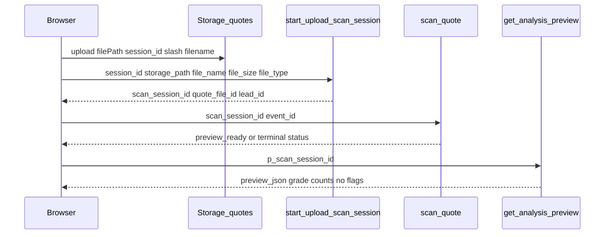

# Funnel Supabase Call Map (V2 Target)

Maps each UI step in the **target V2 funnel** to exact Supabase calls. Reuses the **existing production backend**; V2 adds routes and `ForensicAuditReport` shell only.

**Production today:** [`src/pages/Index.tsx`](../../src/pages/Index.tsx) at `/`.  
**V2 target:** `/scan` + `/report/forensic/:sessionId` (not registered in [`src/App.tsx`](../../src/App.tsx) yet).

---

## Operator blockers (before runtime QA)

1. Create `.env.local` from `.env.example` with **staging** Supabase URL, publishable key, and project ID.
2. Confirm staging ref is not `wkrcyxcnzhwjtdpmfpaf`.
3. Confirm staging migrations match `main`.
4. Confirm Twilio/Gemini staging secrets before real OTP/`scan-quote` smoke.
5. Do not run `npm run typegen` against production.

---

## Critical upload pattern (production)

The browser uploads the file **first**. The Edge Function receives metadata only.



Implementation reference: [`src/components/UploadZone.tsx`](../../src/components/UploadZone.tsx) (~L352–416).

---

## End-to-end step map

| # | Step | UI component (target) | State owner | Storage / table / RPC / function | Request payload (known) | Response required | Failure state | Expected UI |
|---|------|----------------------|-------------|----------------------------------|-------------------------|-------------------|---------------|-------------|
| 0 | Homepage CTA → `/scan` | `AuditHero` or future link (promotion only) | — | None | — | — | — | Navigate to `/scan`; **`/` unchanged until promotion** |
| 1 | `/scan` intake start | `PreUploadIntake` (wired) | `ScanFunnelProvider` | — | — | — | — | Empty / step 1 form |
| 2 | Intake submit | `PreUploadIntake` (mirror `TruthGateFlow`) | `sessionId`, `leadId`, `phoneE164`, `clientSlug` in funnel | EF **`capture-truth-gate-lead`** | See payload below | `{ success: true, lead_id, session_id }` | `{ success: false, code, message }` | Error banner; block upload until success |
| 3 | Quote file selected | `UploadZone` (reuse) | Local upload state + funnel | — | — | — | Invalid type/size | Inline validation message |
| 4 | Storage upload | `UploadZone` | `sessionId` / funnel | Storage bucket **`quotes`** | `upload(filePath, file, { upsert })` | Storage object at `{sessionId}/{ts}_{name}` | `storage_upload_failed` | Retry panel; toast |
| 5 | Scan session bootstrap | `UploadZone` | funnel `scanSessionId`, `quoteFileId`, `leadId` | EF **`start-upload-scan-session`** → writes `leads` / **`quote_files`** / **`scan_sessions`** | `{ session_id, storage_path, file_name, file_size, file_type }` | `{ success: true, scan_session_id, quote_file_id, lead_id }` | `scan_session_create_failed` | Stay on upload; retry |
| 6 | Scan start | `UploadZone.invokeScan` | funnel | EF **`scan-quote`** | `{ scan_session_id, event_id? }` | `analysis_status`, `scan_session_status`, `grade` (variants) | 4xx/5xx body with `scan_session_id` | Stay on upload; retry bound to same session |
| 7 | Scan polling | `ScanTheatrics` + **`useScanPolling`** | Hook: `status`, `error` | RPC **`get_scan_status`** | `{ p_scan_session_id }` | `{ id, status }` | Poll timeout (~60 × 2.5s) | Theatrics / error message |
| 8 | Preview fetch | Post-scan shell / forensic page | **`useAnalysisData`** phase 1 | RPC **`get_analysis_preview`** | `{ p_scan_session_id }` | Grade, counts, `preview_json`, `proof_of_read`; **no flags** | RPC error / null grade | Locked preview / `ForensicAuditReport` preview mode |
| 9 | OTP send | `PreviewUnlockSlot` + **`usePhonePipeline`** | `phoneStatus`, `phoneE164` | EF **`send-otp`** | `{ phone_e164, scan_session_id }` | `{ success: true }` | rate_limit, blocked_prefix, generic | `enter_code` gate UI |
| 10 | OTP verify | Same | funnel `phoneStatus = verified` | EF **`verify-otp`** | `{ phone_e164, code, scan_session_id }` | `{ success, verified, phone_e164, phone_verified_event_id, report_revealed_event_id }` | invalid / expired | Re-prompt code or resend |
| 11 | Full report fetch | Orchestrator `onVerified` → **`fetchFull`** | `isFullLoaded` in `useAnalysisData` | RPC **`get_analysis_full`** | `{ p_scan_session_id, p_phone_e164 }` | `flags`, `full_json`, grade, etc. | `grade === '__UNAUTHORIZED__'` | Loading → full reveal or locked |
| 12 | Forensic reveal render | **`ForensicAuditReport`** | **`useReportAccess`** (`preview` vs `full`) | None (props only) | N/A | N/A | Missing data | Preview: `flags=[]`; full: real flags |
| 13 | Classic fallback | Link / router | — | Navigate to **`/report/classic/:sessionId`** | Same RPCs as [`ReportClassic`](../../src/pages/ReportClassic.tsx) | Same | Same | Classic `TruthReportClassic` |

---

## Payload reference

### `capture-truth-gate-lead` (from [`TruthGateFlow.tsx`](../../src/components/TruthGateFlow.tsx))

```json
{
  "session_id": "<text>",
  "first_name": "<string>",
  "email": "<string>",
  "phone_e164": "+1XXXXXXXXXX",
  "county": "<string>",
  "project_type": "<string>",
  "window_count": <number>,
  "quote_range": "<string>",
  "source": "truth-gate",
  "client_slug": "<required>",
  "utm_source": null,
  "utm_medium": null,
  "utm_campaign": null,
  "utm_term": null,
  "utm_content": null,
  "fbclid": null,
  "gclid": null,
  "fbc": null,
  "fbp": null,
  "landing_page_url": "<string|null>",
  "first_page_path": "<string|null>",
  "initial_referrer": "<string|null>"
}
```

V2 intake must map `PreUploadIntake` fields to this shape (implementation task).

### `start-upload-scan-session`

```json
{
  "session_id": "<same as storage path prefix>",
  "storage_path": "<session_id>/<timestamp>_<filename>",
  "file_name": "<original name>",
  "file_size": <bytes>,
  "file_type": "<mime or null>"
}
```

`storage_path` must be scoped under `session_id/` (enforced in Edge Function).

### `scan-quote`

```json
{
  "scan_session_id": "<uuid>",
  "event_id": "<optional dedup string, max 128>"
}
```

### `send-otp` / `verify-otp`

See [`phoneVerificationService.ts`](../../src/services/phoneVerificationService.ts).

### RPC rows

- **Preview:** first row from `get_analysis_preview` array; empty/missing `grade` → no preview yet.
- **Full:** `__UNAUTHORIZED__` grade → treat as failed auth in [`reportService.fetchAnalysisFull`](../../src/services/reportService.ts).

---

## Terminal `scan_sessions.status` values (polling)

From [`useScanPolling.ts`](../../src/hooks/useScanPolling.ts):

| Status | Meaning | UI direction |
|--------|---------|--------------|
| `preview_ready` | Preview available | Fetch preview; show reveal |
| `complete` | Terminal success variant | Stop poll; preview/full per analysis |
| `invalid_document` | Not a quote | Error / re-upload |
| `needs_better_upload` | OCR weak | Re-upload CTA |
| `error` / `failed` / `unreadable` | Hard failure | Error state |
| `uploading` / `processing` | In progress | Keep theatrics |

---

## V2-specific implementation notes

| Item | Status |
|------|--------|
| `PreUploadIntake` | UI only today; `/sandbox/intake` dev route; **no Supabase** |
| `ReportForensic` page | **Does not exist** — create for `/report/forensic/:sessionId` |
| `/scan` route | **Not in App.tsx** |
| Reuse | `ScanFunnelProvider`, `useAnalysisData`, `usePhonePipeline`, `UploadZone`, `reportService` |
| Do not use | `quote_analyses` table for V2 reads/writes |
| Do not call | `capi-event` from browser |

---

## Identity and persistence keys

| Key | Meaning | Persisted |
|-----|---------|-----------|
| `session_id` | Text scope for storage path + lead lookup | `wm_funnel_sessionId` (24h) |
| `scan_session_id` | UUID `scan_sessions.id` | `wm_funnel_scanSessionId` |
| `lead_id` | UUID `leads.id` | funnel context |
| `quote_file_id` | UUID `quote_files.id` | funnel context |
| `event_id` | Dedup for scan/analytics | Generate once per upload attempt |

---

## Classic vs forensic (same backend)

Both routes must call the same RPCs and Edge Functions. Difference is **presentation only**:

| Route | Renderer | OTP owner |
|-------|----------|-----------|
| `/report/classic/:sessionId` | `TruthReportClassic` | `ReportClassic` page |
| `/report/forensic/:sessionId` | `ForensicAuditReport` | New `ReportForensic` page (planned) |

Forensic route must never receive full `flags` before step 11 succeeds.

---

## Related docs

- [LOCAL_CUTOVER_CHECKLIST.md](./LOCAL_CUTOVER_CHECKLIST.md)
- [SUPABASE_STAGING_VERIFICATION.md](./SUPABASE_STAGING_VERIFICATION.md)
- [QA_MATRIX.md](./QA_MATRIX.md)
- [docs/sprints/phase-0-repo-truth-audit.md](../sprints/phase-0-repo-truth-audit.md) — refresh/resume caveats for homepage
